Want to grand and remove item or folder permissions in SharePoint using **Power Automate** with a Service Principle but can't do it? Not able to do it with the out of the box SharePoint Connector?

Tired of dealing with Conditional Access Policies, password expirations, and frequent logins?

Good news! In this guide, I'll show you how to set these using an App Registration. No service accounts, no password headaches. I'll also share a Custom Connector to make it even easier, plus step-by-step instructions to:

- Create and configure the App Registration
- Assign API permissions
- Setting permissions using sites.selected
- Use Power Automate with the custom connector





## Whats the problem

Let's have a look at the problem we are trying to solve. We are going to go into Power Automate Flow and see if we can edit, add, or remove a SharePoint Permission using the [Standard SharePoint Connector](https://learn.microsoft.com/en-us/connectors/sharepointonline/).


As we can see it is not possible.

To solve this problem I am going to share with you a connector I have written and released that is free to use, and show you how to set it up and use it.

## Create the App Registration

For this section you will need the help of a Global Administrator
 
### Step 1 - Log in to Entra
 
By default most users will have the ability to go to [https://entra.microsoft.com](https://entra.microsoft.com)
and log in with your user account.


### Step 2 - Create the app registration

Next we are going to create an application registration so our Power Automate flow can talk directly to SharePoint Online.

1. When you are on the Entra Overview page, open up **Identity**.
2. Then navigate to **Applications** in the left hand menu and then open up **App Registrations**.
3. From there select **New Registration**.
4. A new screen will open, give your new app registration a name and then click next.

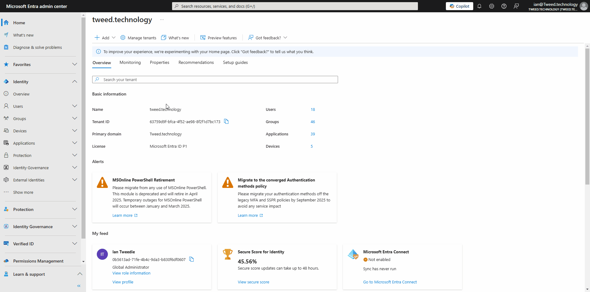

### Step 3 - Add API permission

We then need to give our App Registration an API Permission, This will be the permission used to talk to Exchange Online.

1. In the left hand menu click on **API Permission**.
2. Click on **Add permission**.
3. A window will then open, select **Application Permission**.
4. Then using the search box type in `sites.selected`.
5. The list will then filter, as it does open up the **Mail** option and select `sites.selected`.


### Step 4 - Grant Admin consent

1. If the Grant admin consent is grayed out then this is because we lack administrative roles for our account. For this next step you will need a some help from a Global Admin.

2. Ask a Global administrator to grant admin consent for you if you cant do it.

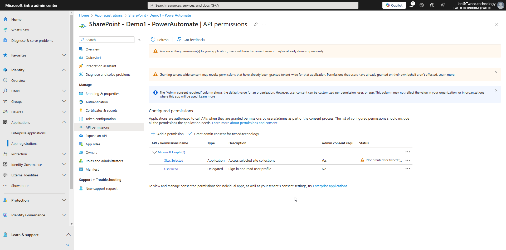

## Setting your application permissions in SharePoint Online

Our next step is to set what permissions the application has within SharePoint. This is different to Exchange where you are limiting the default permission, with `sites.selected` we have to explicitly give permission rather than specifically limiting it.
This Stage will need to be done by someone who is an Owner of the SharePoint site using Microsoft Graph.  

> **Further reading:** Further information on the API call can be found [here](https://learn.microsoft.com/en-us/graph/api/site-post-permissions?view=graph-rest-1.0&tabs=http).

### Step 1 - Get SharePoint Site ID

Navigate to your SharePoint Site, e.g. `https://tweedtech.sharepoint.com/sites/TechTweedieDemoSite1` and then just add `/_api/site?$select=Id` on the end.

For example this would give you the URL `https://tweedtech.sharepoint.com/sites/TechTweedieDemoSite1/_api/site?$select=Id`.

You will get XML back that looks like this

```xml
<?xml version="1.0" encoding="utf-8"?>
<entry xml:base="https://tweedtech.sharepoint.com/sites/TechTweedieDemoSite1/_api/" xmlns="http://www.w3.org/2005/Atom" xmlns:d="http://schemas.microsoft.com/ado/2007/08/dataservices" xmlns:m="http://schemas.microsoft.com/ado/2007/08/dataservices/metadata" xmlns:georss="http://www.georss.org/georss" xmlns:gml="http://www.opengis.net/gml">
   <id>https://tweedtech.sharepoint.com/sites/TechTweedieDemoSite1/_api/site</id>
   <category term="SP.Site" scheme="http://schemas.microsoft.com/ado/2007/08/dataservices/scheme" />
   <link rel="edit" href="site" />
   <title />
   <updated>2025-02-13T21:53:24Z</updated>
   <author>
       <name />
   </author>
   <content type="application/xml">
       <m:properties>
           <d:Id m:type="Edm.Guid">9ce4e8e2-fa87-474b-bd2f-d858d828f8a1</d:Id>
       </m:properties>
   </content>
</entry>
```

Locate the ID value, it will look something like this from within the xml 

```xml
<d:Id m:type="Edm.Guid">9ce4e8e2-fa87-474b-bd2f-d858d828f8a1</d:Id>
```

We need the Site ID value which in this example is `9ce4e8e2-fa87-474b-bd2f-d858d828f8a1`

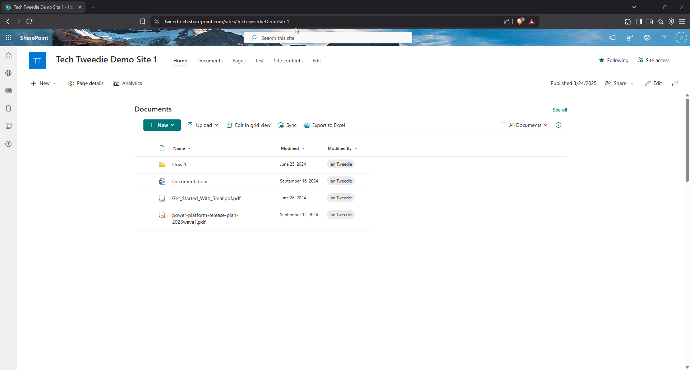

### Step 2 - Give Permission to our App Registration for this site

The first stage is to give the permission to our app permissions on the SharePoint site, to do this we need to use Graph Explorer. You will also need to be an Owner of the SharePoint Site you are giving permissions to.

### Step 1 - Access MS Graph Explorer

1. Go to [https://developer.microsoft.com/en-us/graph/graph-explorer](https://developer.microsoft.com/en-us/graph/graph-explorer)
2. Sign in to your account.
3. Make sure the Tenant shows your tenant or company name. 
4. Then Press **Run query** to make sure you are connected. 

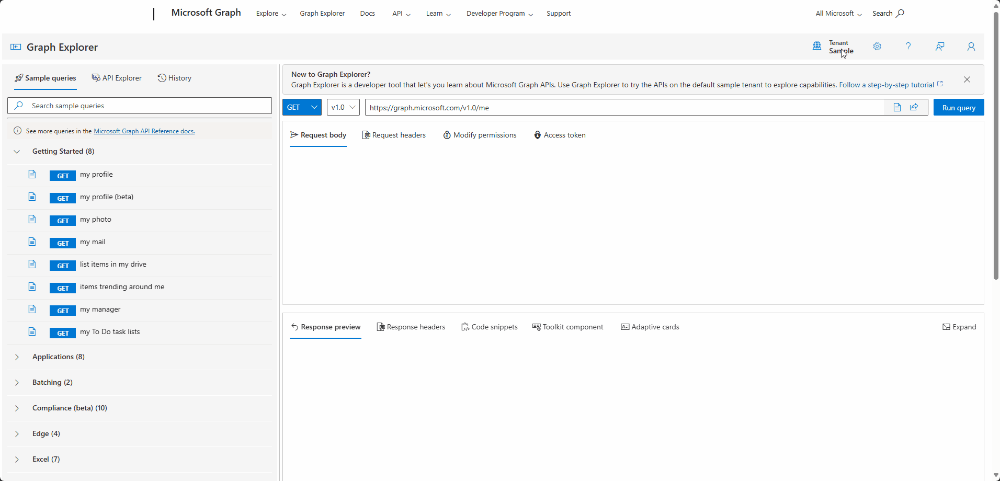

### Step 2 - Set permissions

The next stage is to run the **Create permission** command for the app registration to give tit the necessary permissions to be able to set permissions for files and folders.

To do this we need to;

1. Change the method to `POST`.
2. Enter in the following address `https://graph.microsoft.com/v1.0/sites/{sitesId}/permissions`, replacing the `{siteID}` with your **siteID**. e.g. `https://graph.microsoft.com/v1.0/sites/9ce4e8e2-fa87-474b-bd2f-d858d828f8a1/permissions`.
3. Click on **Modify permissions** and open the **permissions panel**.
4. Search for site, and then open up **Sites**.
5. Click on **Consent** for `Sites.FullControl.All`. This will open up a consent screen.
6. Then in **Request body** enter in the below json replacing `{clientID}` and `{displayName}` with your applications details.  

    ```json
    { 
    "roles": ["write"],
    "grantedToIdentities": [
      {
        "application": {
          "id": "{clientID}",  
          "displayName": "{displayName}" 
        }
      }
      ]
    }
    ```
    e.g.

    ```json
    { 
    "roles": ["write"],
    "grantedToIdentities": [
      {
        "application": {
          "id": "229df885-246d-4b6f-8280-267e51f9dc65",  
          "displayName": "SharePoint - Demo1 - PowerAutomate" 
        }
      }
      ]
    }
    ```

7. You will then get the response like the below

    ```json
    {
        "@odata.context": "https://graph.microsoft.com/v1.0/$metadata#sites('9ce4e8e2-fa87-474b-bd2f-d858d828f8a1')/permissions/$entity",
        "id": "aTowaS50fG1zLnNwLmV4dHwyMjlkZjg4NS0yNDZkLTRiNmYtODI4MC0yNjdlNTFmOWRjNjVANjM3NTlkOWYtYmZjYS00ZjUyLWFlOTgtOGYyZjFkN2JjMTcz",
        "grantedToIdentitiesV2": [
            {
                "application": {
                    "displayName": "SharePoint - Demo1 - PowerAutomate",
                    "id": "229df885-246d-4b6f-8280-267e51f9dc65"
                }
            }
        ],
        "grantedToIdentities": [
            {
                "application": {
                    "displayName": "SharePoint - Demo1 - PowerAutomate",
                    "id": "229df885-246d-4b6f-8280-267e51f9dc65"
                }
            }
        ]
    }
    ```

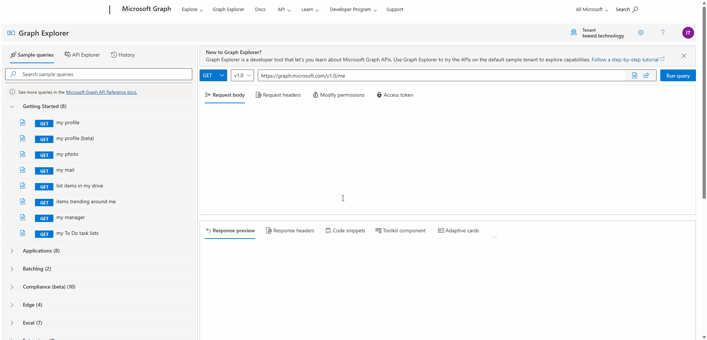


## Download and testing the connector

### Step 1 - Find custom connectors

First we need to find custom connectors in Power Automate.

To do this we need to:

1. Navigate to `https://make.powerautomate.com/`
2. Change our environment should you need to.
3. Then in the left hand menu, navigate to **More** and then **Discover all**, and then locate **Custom connectors**.


### Step 2 - Create a new connector

1. Click on **New custom connector**.
2. Then click on **Import an OpenAPI from URL**.
3. Then enter in the connector name `SharePoint with Graph`.
4. Then enter in the URL `https://raw.githubusercontent.com/itweedie/PowerPlatform-PowerAutomate-SharePoint-with-Graph-Connector/refs/heads/main/connector/shared_sharepoint-20with-20graph-5fbb1338f75d4745cb-5f8d99aea54e2a1a34/apiDefinition.swagger.json`

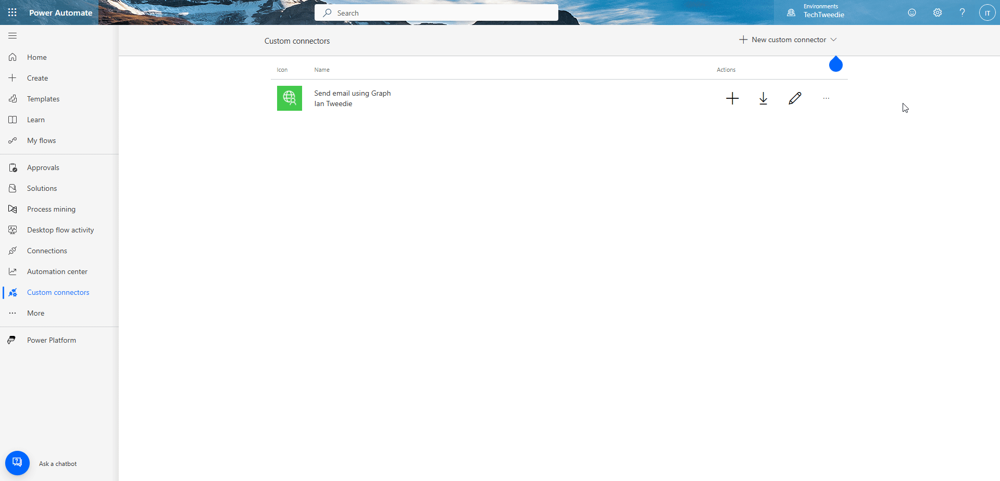

### Step 3 - Configure your connector

1. Click on to the Security tab.
2. Make sure we are using **OAuth 2.0**
3. Make sure the Identity Provider is set to **Azure Active Directory** and that **Enable Service Principle support** is ticked.
4. Click in to **Client ID**
5. Navigate back to Entra and locate your App Registration.
6. Copy the **Client ID** and paste it in to the **Client ID** box on the Custom Connector.
7. Go back to the App Registration in Entra, and click on **Certificates & secrets**, then click on **New client secret**. Choose a name and a reasonable date for expiry that fits within your organisations policy's.
8. Copy the **Secret value**, NOT Secret ID, and paste it in to your connector. You will need your secret ID one more time so keep the Entra page open with it on.
9. Enter in **Resource URL** as `https://graph.microsoft.com`.
10. Click Create

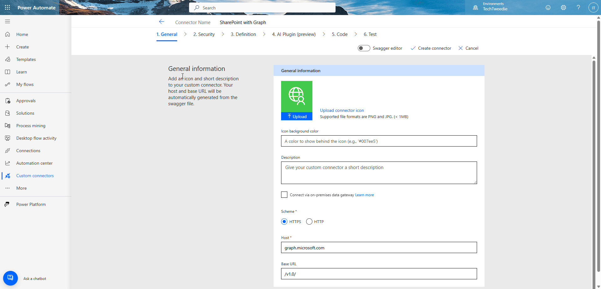

### Step 5 - Add your first connection
 
1. Click on to Test.
2. Then click on to **New connection**.
3. You should then get a screen which lets your choose **Service Principle**, if you don't repeat step 3.
4. Then click **Create Connection**.
5. Enter in your **Secret** (we do this first as we already have the page open from Step 3).
6. Then enter in your **Client ID** and **Tenant ID**.
7. Then click **Create Connection**.

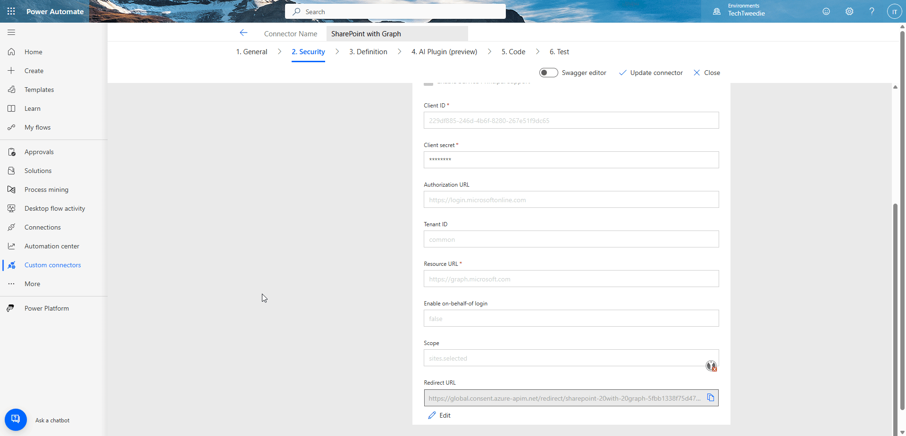

### Step 6 - Test get site information

Lets see if we can connect to our SharePoint Site using out app registration. 

1. On the **Test** tab click on **SiteInfomation**.
2. Enter in the details from your site URL. For our demo we are using `https://tweedtech.sharepoint.com/sites/TechTweedieDemoSite1/`.
   1. We will enter in the **tenantPrefix**, for us this is `tweedtech`.
   2. For site name we will enter in `TechTweedieDemoSite1` from the url of our site. 
   3. For site path we can see from the URL this is `sites`.
3. Click on **Test operation** to see if it works.

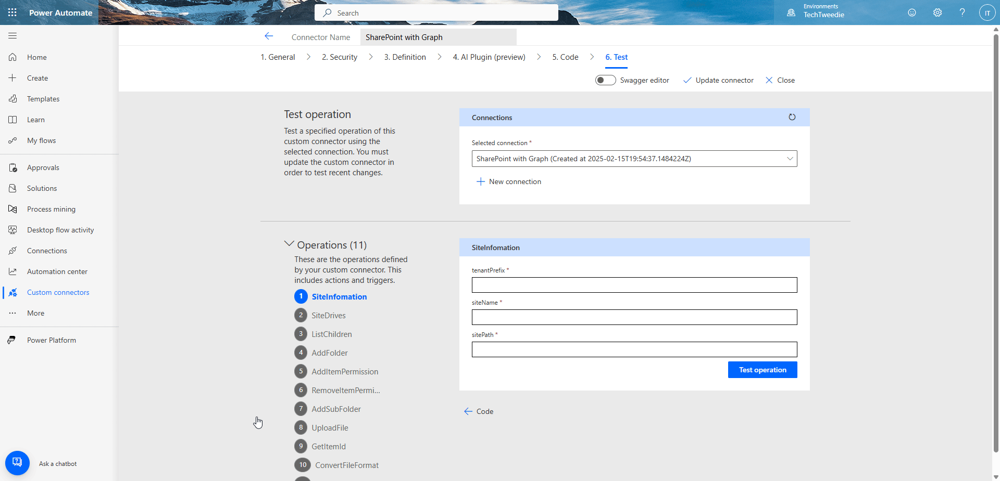

## Testing adding a permission

You can skip this part if you would like, and go to the next section.

### Step 1 - Test 2 to list drives

We are going to test the ability to list site drives. The site drives are the document libraries contained within a SharePoint Site, and we will need the drive ID to set permissions later.

Enter in your site id, for us this is `9ce4e8e2-fa87-474b-bd2f-d858d828f8a1` and we will get our Drive ID back which for us is `b!4ujknIf6S0e9L9hY2Cj4oSy8fRwGRJ9Ghv-lEfn4u6ovHPyydePwRosMG0M4nhQc`. 

We can do this in Power Automate Flow later or save it as an environment variable, or hard code it depending on how we want to use it. 

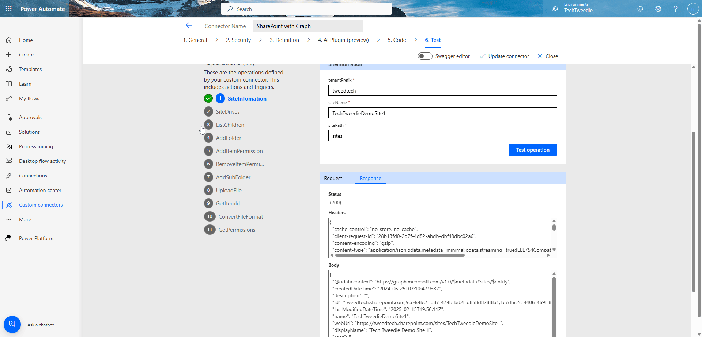

### Step 2 - Let's test adding a folder

So we have something to give permission for. 

To do this lets;

1. Click on the AddFolder action.
2. Enter in **siteID**, for us this is `9ce4e8e2-fa87-474b-bd2f-d858d828f8a1`.
3. Let's enter in our **driveID** which is `b!4ujknIf6S0e9L9hY2Cj4oSy8fRwGRJ9Ghv-lEfn4u6ovHPyydePwRosMG0M4nhQc`.
4. Then lets give our folder a name, we have to enter this twice. 
5. We have got the response back and as part of the response we have an item ID `01LDPBINVTIMOY4Y3TGRDIDMVHU4F3HIZM`. 
6. We will need the **item ID** to set the permissions against. 

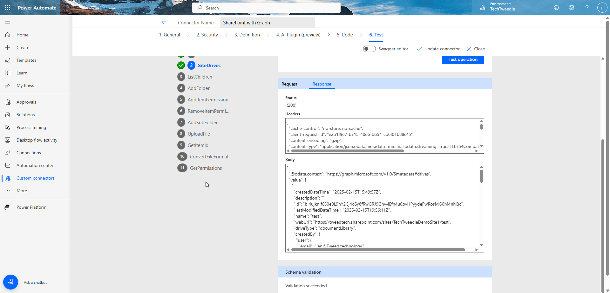

### Step 3 - Let's add the permission

We are now able to test adding the permission. 

1. Click on to **AddItemPermission**.
2. Enter in **siteID**, for us this is `9ce4e8e2-fa87-474b-bd2f-d858d828f8a1`.
3. Let's enter in our **driveID** which is `b!4ujknIf6S0e9L9hY2Cj4oSy8fRwGRJ9Ghv-lEfn4u6ovHPyydePwRosMG0M4nhQc`.
4. Then our **itemID** which we have as `01LDPBINVTIMOY4Y3TGRDIDMVHU4F3HIZM`.
5. Then we need add in a **message**. We are going to put in `Test Message`.
6. We are going to set **RequireSignIn** to `true`.
7. We are going to set **sendInvitation** to `true`.
8. The email of the user we are going to invite is `demo@tweed.technology`.
9. Add the permission we are going to give them is `read`.

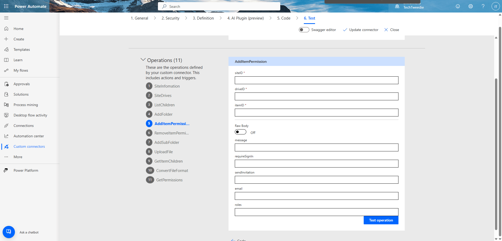

We can also see we got this through as an email message to.

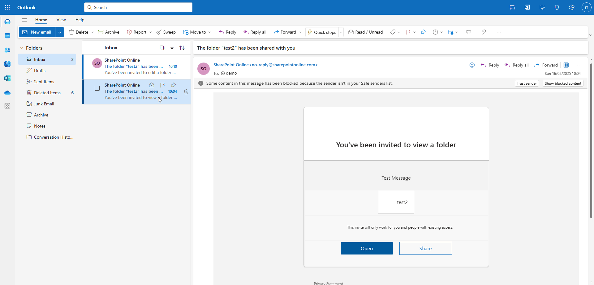

### Step 4 - Lets try it in a Flow
 
1. Click on **My flows**
2. Create a new flow.
3. Add a trigger.
4. Add a new step.
5. From Connector type choose Custom.
6. Then select **SharePoint with Graph** from the list.
7. Enter in **siteID**, for us this is `9ce4e8e2-fa87-474b-bd2f-d858d828f8a1`.
8. Let's enter in our **driveID** which is `b!4ujknIf6S0e9L9hY2Cj4oSy8fRwGRJ9Ghv-lEfn4u6ovHPyydePwRosMG0M4nhQc`.
9. Then our **itemID** which we have as `01LDPBINVTIMOY4Y3TGRDIDMVHU4F3HIZM`.
10. Then we need add in a **message**. We are going to put in `Test Message`.
11. We are going to set **RequireSignIn** to `true`.
12. We are going to set **sendInvitation** to `true`.
13. The email of the user we are going to invite is `demo@tweed.technology`.
15. Add the permission we are going to give them is `write`.
16. Test and make sure the email comes through.


We can we have got an email through so our user is aware they have been given access to this folder.


## Lets Demo in a Power Automate Flow

Let's demo is in Power Automate flow, so we can set the permissions for a folder we will create.

### Step 1 - Start with a flow to list the drives

First we need to List the Drives in our site so we can find the right one.

1. Add a new step.
2. From Connector type choose Custom.
3. Then select **SharePoint with Graph** from the list.
4. Enter in **siteID**, for us this is `9ce4e8e2-fa87-474b-bd2f-d858d828f8a1`.


### Step 2 - Filter the drives we got back

Our next step is to filter the array of drive's we got back.

1. Add a new step
2. Search for `filter`.
3. Click on the data operation filter action.
4. Then add the following details;
   1. In from select `value` from the **Site Drves** step.
   2. In the **Choose value box** select `name` from the **Site Drves** step.
   3. Enter the name of your document library in our example this is a library called `test`.
5. Let's test it.
6. What we get back in outputs are the details for the document library which we will use in our next step.

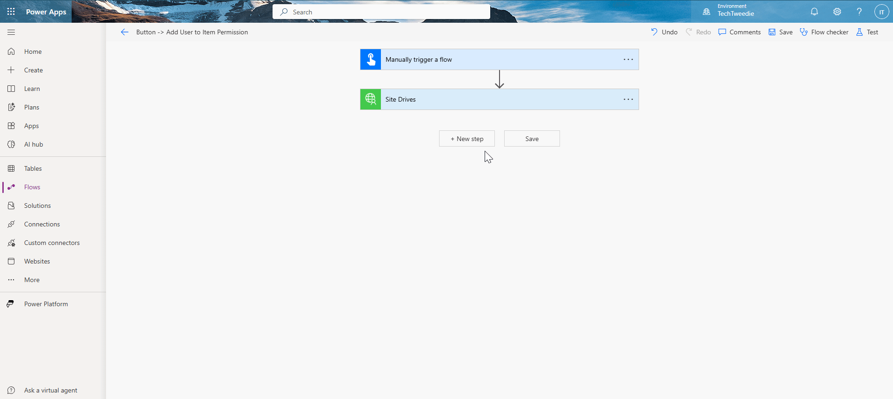

### Step 3 - Let's test adding a folder

So we have something to give permission for. 

To do this lets;

1. Add a new step.
2. From Connector type choose Custom.
3. Then select **SharePoint with Graph** from the list.
4. Click on the **Add Folder** action.
5. Enter in **siteID**, for us this is `9ce4e8e2-fa87-474b-bd2f-d858d828f8a1`.
6. In the **Drive ID** add in the `id` from the filter action.
7. Then lets give our folder a name, we have to enter this twice. 

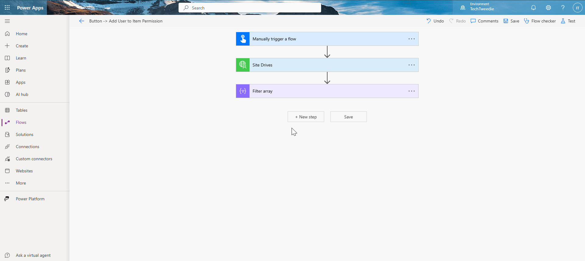

### Step 4 - Let's add the permission

We are now able to test adding the permission. 

1. Add a new step.
2. From Connector type choose Custom.
3. Then select **SharePoint with Graph** from the list.
4. Click on to **Add Item Permission**.
5. Enter in **siteID**, for us this is `9ce4e8e2-fa87-474b-bd2f-d858d828f8a1`.
6. Let's select our **drive ID** add in the `id` from the filter action.
7. Let's select our **item ID** add in the `id` from the **Add Folder** action.
8. Then we need add in a **message**. We are going to put in `Test Message`.
9. We are going to set **Require Sign In** to `Yes`.
10. We are going to set **Send Invitation** to `Yes`.
11. The email of the user we are going to invite is `demo@tweed.technology`.
12. Add the permission we are going to give them is `write`.


### Conclusion

Congratulations! You have successfully set folder permissions in SharePoint using Power Automate Flow. By following these steps, you can streamline your workflow and ensure that the right people have the appropriate access to your SharePoint folders. This process not only saves time but also enhances the security and management of your documents. Keep exploring the capabilities of Power Automate to further optimize your SharePoint experience. Happy automating!
