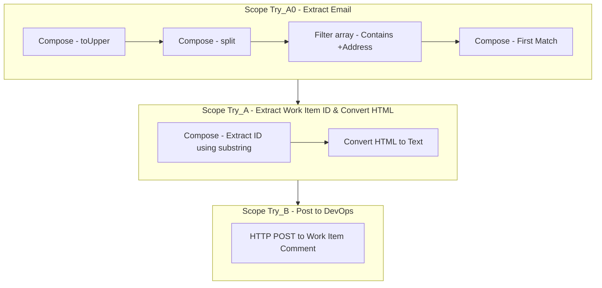

# Auto-Tag DevOps Tickets via Email using Power Automate

In this episode of the Power Platform Clinic, we explore how to keep Azure DevOps tickets updated when discussions happen over email.



---

## Why It’s Handy

You often need to chase suppliers or clients via email. This approach helps thread those email updates directly into DevOps using **plus addressing** and **Power Automate**.

---

## What You’ll Need

- A shared mailbox that supports plus addressing  
- Power Automate  
- Azure DevOps API

---

## 🗺️ Flow Overview



---

## 🔧 Key Expressions

### Extract Recipient Email (Uppercase & Split)
```powerautomate
@toUpper(triggerOutputs()?['body/toRecipients'])
```

```powerautomate
@split(outputs('GET_ID0'),';')
```

### Filter to Find +Address
```powerautomate
@contains(item(),'DUNCAN.BOYNE')
```

### Extract Work Item ID
```powerautomate
@substring(outputs('EMAIL'), add(indexOf(outputs('EMAIL'), '+'), 1), sub(indexOf(outputs('EMAIL'), '@'), add(indexOf(outputs('EMAIL'), '+'), 1)))
```

### HTTP POST to Azure DevOps
```json
{
  "workItemId": "@{outputs('GET_ID')}",
  "text": "@{body('Html_to_text')}"
}
```

---

## ✅ Result

This setup lets you:

- Email using plus addressing like `support+123@domain.com`
- Extract the DevOps ticket number
- Convert email body to plain text
- Post the content as a comment to the DevOps item

---

## Wrap-Up

It’s a simple, powerful way to ensure nothing gets missed—especially when your team lives in Outlook more than DevOps.

Want the full expressions and examples? Stay tuned for the downloadable version, or get in touch.

---

🎥 Watch the video: [https://youtube.com/watch?v=FgAxJkx6Zyk](https://youtube.com/watch?v=FgAxJkx6Zyk)  
❓ Got a question? Submit it here: [https://powerplatformclinic.github.io](https://powerplatformclinic.github.io)