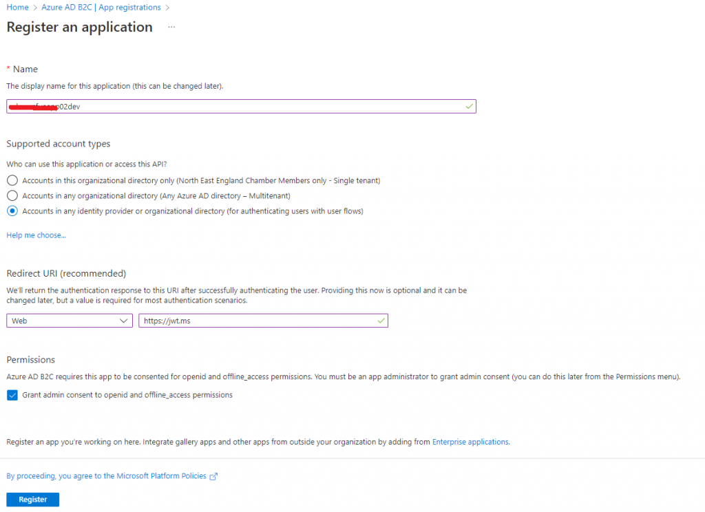
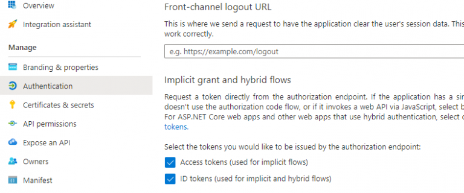
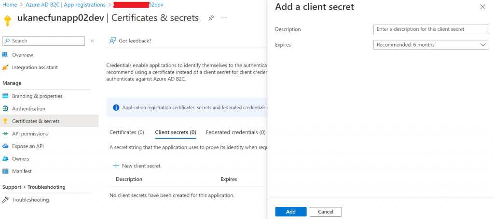
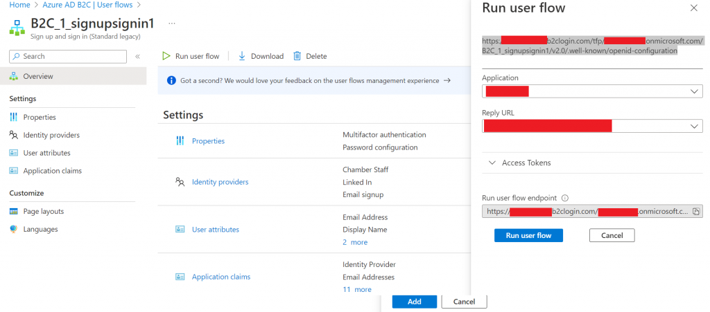
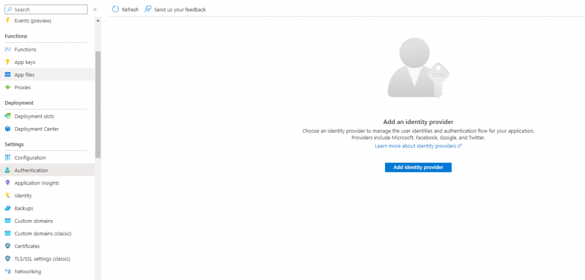
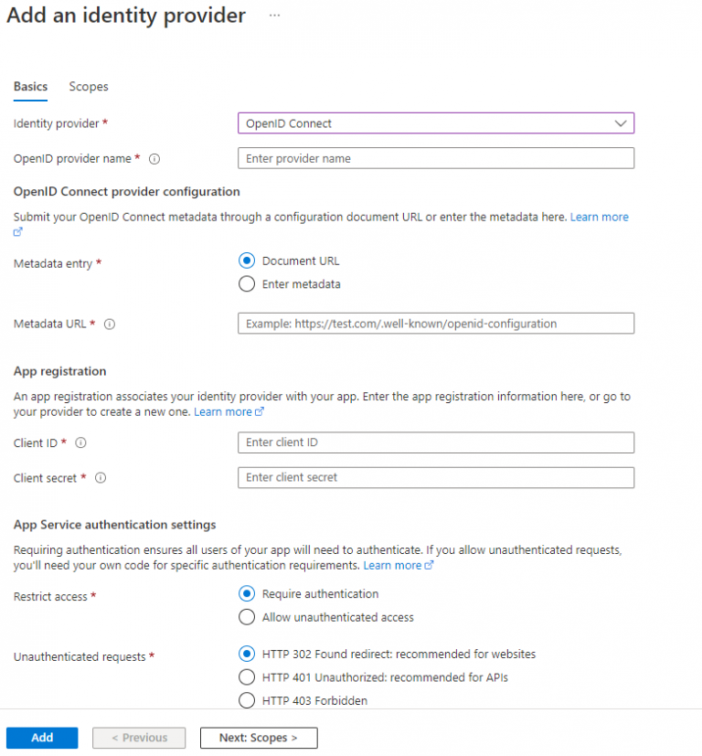

Azure functions are a very handy way of getting something small done very quickly. Often these have to be secured and sometimes with an identity provider that is not stright out of the box.

Today I am going to take you through the steps I took to secure an azure function using Azure B2C.

## Step 1 – Create app in Azure B2C

### PREREQUISITE

- Azure Function
- The Azure Function URL
- Azure B2C Tenant configured with user flows

### STEP 1

To start with register an application in Azure B2C.

In Redirect URI, (where I have put in https://jwt.ms) enter in the following: `https://{azure function url}/.auth/login/aadbc/callback`

Once you have registered it, open up the application and click on to **Authentication**. Scroll down and tick both **Access tokens** and **ID tokens**.

Next we will need to create a the Secrets, so click on **Certificates & secrets** in the left hand menu, and then click on **New client secret**.

Once you click on **Add**, you will then be able to see the secret, copy it somewhere as we will need it later and you won’t be able to see it again.

We also need to grab the client id of the application we have created.

Also, while you are in your Azure B2C tenant, grab the URL to the **.well-known/openid-configuration**. There are a few ways you can get this; one is by going in to one of your **user flows** used for **sign up sign in**. Click on **Overview**, and then **Click on Run user flow**.

## Step 2 – Add authentication to your Azure Function

Navigate to your Azure Function, this won’t be inside your Azure B2C tenant.

Go to **Authentication** under **Settings** in the left-hand menu.

Click on **Add identity provider**, and choose **OpenID Connect**. You will then be presented with a page that looks like this.

Under OpenID provider name enter in: aadbc

Metadata URL enter: the **.well-known/openid-configuration** URL

Then make sure that under **Restricted access** you have chosen **Require authentication**, and then under **Unauthenticated requests** you have chosen an option appropriate for your needs.

## Step 3 – Test it

Give it a test, try and access something you have placed behind it and it should work 🙂