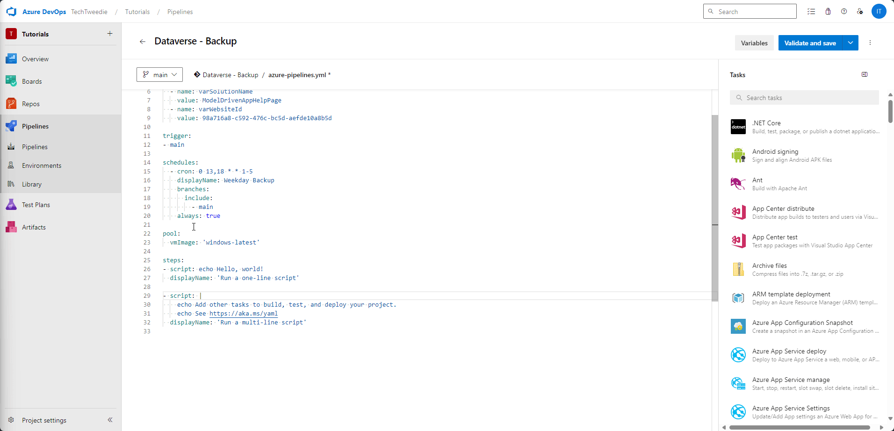
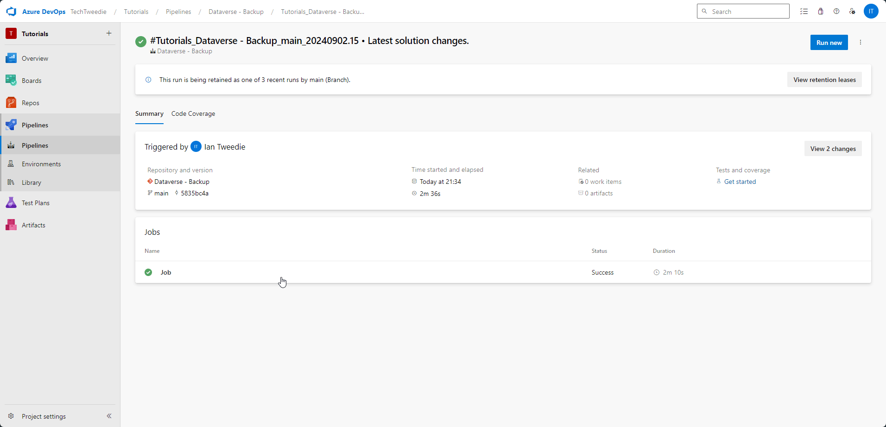

## Introduction
Ever wondered what would happen if you lost your development environment? How do you feel about having to do all of that work again? What about if you spot a problem days later? Can you remember the value you changed three days ago in that flow? Have you ever seen someone delete the website record by mistake.

These are all situations I have been in over the last few years, and having a Pipeline in place to ensure backup of your hard work is extremely important. That historical record can save you many hours.

Today am going to take you through how to create a DevOps Pipeline to backup your environment.

**You can watch the accompanying YouTube video here**


## Prerequisites for Setting Up a Pipeline in Azure DevOps to Export a Solution from Dataverse

1. **Azure DevOps Organization**: 
   - Ensure you have an Azure DevOps organization. If not, you can create one for free here.

2. **Azure Repos**: 
   - A repository where your pipeline code will reside. 

3. **Dataverse Environment**: 
   - Ensure you have access to the Dataverse environment from which you want to export the solution.

4. **Service Principal**: 
   - Create a service principal in Azure Active Directory (AAD) with the necessary permissions to access Dataverse.

5. **Power Platform Build Tools**: 
   - Install the Power Platform Build Tools extension in Azure DevOps. This extension provides tasks to automate common build and deployment activities related to Power Platform.


## Create our backup pipeline
### Step 1: Navigate to the Pipelines Screen
From within our Devops Project screen, we need to navigate to *Pipelines > Pipelines*

### Step 2: Create first Pipeline
Then we are going to create our first pipeline. To do this click on create Pipeline, then choose Azure Repos, and then choose starter pipeline. Once we have done that we will then run our pipeline. 


### Step 3: Pipeline results
After running our pipeline for the first time we can see we have an issue, for our DevOps organisation, in this case TechTweedie we don't have parallelism. If you don't see this error and your pipeline runs, then please skip to step X

### Step 4: Request Parallelism
To enable this we need to fill out this form https://aka.ms/azpipelines-parallelism-request 


### Step 5: After a little while approval comes through
An email comes through outlining that parallelism in Azure DevOps has been enabled.

### Step 6: Lets try again
Trying again we can now see our pipeline ran successfully. We now have a working Pipeline.


### Step 7: Lets edit our pipeline


### Step 8
We are going to set the name and some variables 
```yaml
name: $(TeamProject)_$(BuildDefinitionName)_$(SourceBranchName)_$(Date:yyyyMMdd)$(Rev:.r)

variables:
  - name: varPowerPlatformSPN
    value: <YOUR SERVICE CONNECTION>
  - name: varSolutionName
    value: <YOUR SOLUTION NAME>
  - name: varWebsiteId
    value: <YOUR WEBSITE ID IN HERE>
```


### Step 9


### Step 10
Update our variables


### Step 11: Change VM pool
Next we are going to change the vm pool image over to be `vmImage: 'windows-latest'`


### Step 12: Check out our Repository
We want to check out the repository that we want to update with the latest solution export from Power Platform. 

```yaml
- checkout: self
  persistCredentials: true
  clean: true
```


### Step 13: Add build tools
Delete what is already there and add in the Power Platform build tool step


### Step 14: Add Who am I and then Test
Add in the Who Am I step so we can test the connection, and then don't forget to change over the variable to make it easier to re-use the pipeline later on future projects. 


### Step 15: Lets test it
Lets test our work so far.


### Step 16: Set version number
Now that it's working we are going to set the solution version, we can do this by adding a task in, called **Set Solution Version**. Once we add this task we are going to update it with out variable for the **Power Platform SPN**, and **Solution Name**. Then we are going to set the **Solution Version Number** to be `'1.0.0.$(Build.BuildID)'`. This pulls in the Build ID ensuring that the solution number is always unique. 


### Step 17: Export the solution as Managed
Then we are going to export the solution, once again we are going to set the **Power Platform SPN**, **Solution Name**, we are also going to set the **Solution Output File** to `$(Build.ArtifactStagingDirectory)\$(varSolutionName)_managed.zip`


### Step 18: Export the solution as Un-Managed
Next we are going to copy the YAML from our last step and then change it slightly to get our unmanaged solution.


### Step 19: Unpack solution
Then unpack the solution, this allows us to see what's changed inside between runs. For this step we will set **Solution Input File** to `$(Build.ArtifactStagingDirectory)\$(varSolutionName).zip'`, and the **Solution Target Folder** to `'$(Build.SourcesDirectory)\src\solutions\$(varSolutionName)'`


### Step 20: Commit it
We are going to commit these changes to our repository.
```cmd
echo commit all changes
git config user.email "$(Build.RequestedForEmail)" 
git config user.name "$(Build.RequestedFor)" 
git checkout -b main 
git add --all 
git commit -m "Latest solution changes." 
echo push code to new repo 
git -c http.extraheader="AUTHORIZATION: bearer $(System.AccessToken)" push origin main
```


### Step 21: Lets check if it worked
Next lets check if it worked.


Oh no let's see if we can fix it.


Let's test it again.


### Step 22: Check over our pipeline
Lets check over our pipeline to understand if it is working correctly. It looks like it is triggering all the time, lets take a look at our pipeline code to see if we can understand where the problem is coming from. 

As we can see, we have a trigger whenever a commit is made to the main branch, this means that because we are committing at the end of our pipeline its in an endless cycle. So lets remove the trigger on the main branch.



### Step 23: Take a look at the Repo
Looking at the repo


## Pipeline Script in Full
Here is the YAML pipeline script in full
```yaml

name: $(TeamProject)_$(BuildDefinitionName)_$(SourceBranchName)_$(Date:yyyyMMdd)$(Rev:.r)

variables:
  - name: varPowerPlatformSPN
    value: Dataverse - Backup
  - name: varSolutionName
    value: ModelDrivenAppHelpPage
  - name: varWebsiteId
    value: 98a716a8-c592-476c-bc5d-aefde10a8b5d


schedules:
  - cron: 0 13,18 * * 1-5
    displayName: Weekday Backup
    branches:
      include:
        - main
    always: true

pool:
  vmImage: 'windows-latest'

steps:
- checkout: self
  persistCredentials: true
  clean: true
- task: PowerPlatformToolInstaller@2
  inputs:
    DefaultVersion: true
    AddToolsToPath: true
- task: PowerPlatformWhoAmi@2
  inputs:
    authenticationType: 'PowerPlatformSPN'
    PowerPlatformSPN: '$(varPowerPlatformSPN)'
- task: PowerPlatformSetSolutionVersion@2
  inputs:
    authenticationType: 'PowerPlatformSPN'
    PowerPlatformSPN: '$(varPowerPlatformSPN)'
    SolutionName: '$(varSolutionName)'
    SolutionVersionNumber: '1.0.0.$(Build.BuildID)'
- task: PowerPlatformExportSolution@2
  inputs:
    authenticationType: 'PowerPlatformSPN'
    PowerPlatformSPN: '$(varPowerPlatformSPN)'
    SolutionName: '$(varSolutionName)'
    SolutionOutputFile: '$(Build.ArtifactStagingDirectory)\$(varSolutionName)_managed.zip'
    Managed: true
    AsyncOperation: true
    MaxAsyncWaitTime: '60'
- task: PowerPlatformExportSolution@2
  inputs:
    authenticationType: 'PowerPlatformSPN'
    PowerPlatformSPN: '$(varPowerPlatformSPN)'
    SolutionName: '$(varSolutionName)'
    SolutionOutputFile: '$(Build.ArtifactStagingDirectory)\$(varSolutionName).zip'
    Managed: false
    AsyncOperation: true
    MaxAsyncWaitTime: '60'
- task: PowerPlatformUnpackSolution@2
  inputs:
    SolutionInputFile: '$(Build.ArtifactStagingDirectory)\$(varSolutionName).zip'
    SolutionTargetFolder: '$(Build.SourcesDirectory)\src\solutions\$(varSolutionName)'
    SolutionType: 'Both'
- task: CmdLine@2
  inputs:
    script: |
      echo commit all changes
      git config user.email "$(Build.RequestedForEmail)"
      git config user.name "$(Build.RequestedFor)"
      git checkout -b main
      git add --all
      git commit -m "Latest solution changes."
      echo push code to new repo
      git -c http.extraheader="AUTHORIZATION: bearer $(System.AccessToken)" push origin main

```
## Conclusion & Next vlog
This is a very useful way of creating a backup of your development or build environments, so you have a record of what has changed in the event of something going wrong. 

In the next post I will expand on the pipeline adding features such as Power Pages Portal, exploring changes to the xml, along with environment variables, and auto generated wiki articles based upon your solution components. 

If there are any of the pre-requisite steps you would like more detail on please comment on the YouTube video here and I will happy make them. 