## Introduction
Want to get started using the Power Apps Component Framework (PCF), would you like to start building controls. In this blog post we are going to step through the process to building your first component. 

**You can watch the accompanying YouTube video here**


### What languages
To build out our component, we will be using both **TypeScript** and **HTML**. Don't worry if you haven't worked with these before.

### Tools
The tools we will be using today will be; 
- Visual Studio Code
- Power Platform Tools Extension

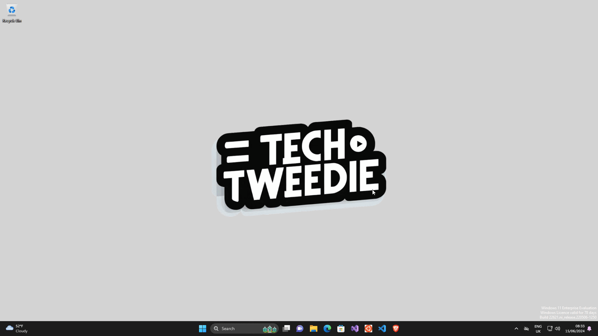

- NodeJS LTS

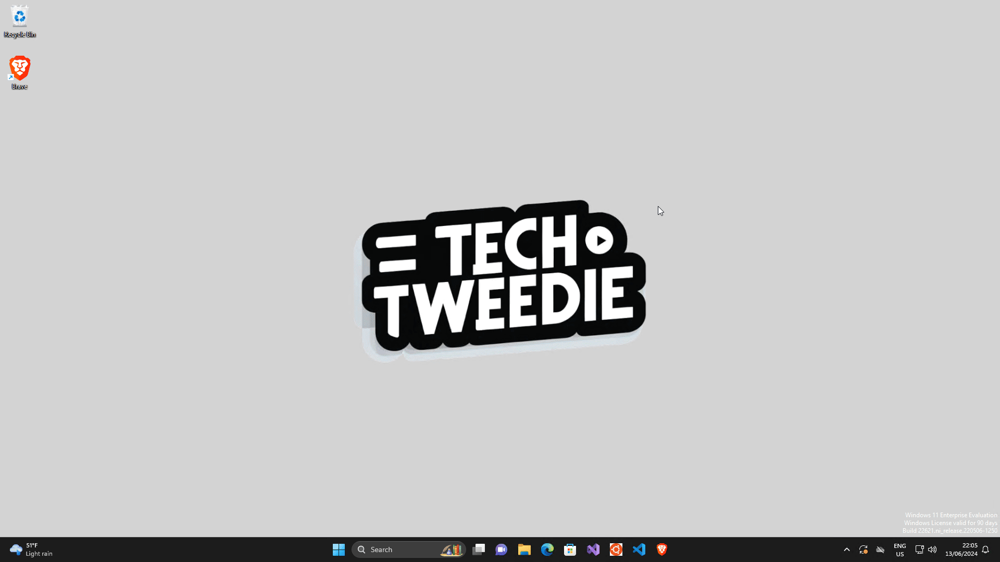

### Why PCFs
We use the PowerApps Component Framework to extend our apps, and to achieve function that is not available out of the box. Out low code canvas can't always achieve what our clients would like and this is when we look to towards this kind of functionality. 

### Options for building controls
We have two frameworks we can utilise, alongside two different templates. 
#### Frameworks - Visual function
- Standard Controls - These don't have REACT out of the box.
- React (Virtual) Controls - You get to take advantage of REACT that is already been used in the Dataverse, which reduces the size of your controls.
#### Control Templates - Placement of control
- Dataset - These can be used instead of view and sub grids
- Field - These are bound to a field and are limited to being used on a form

## Building our first PCF control

### Step 1: Authenticate 
We can authenticate against dataverse with the following command in PowerShell within Visual Studio Code. 

```PowerShell
pac auth create -env yourenv.crm11.dynamics.com
pac auth list
```

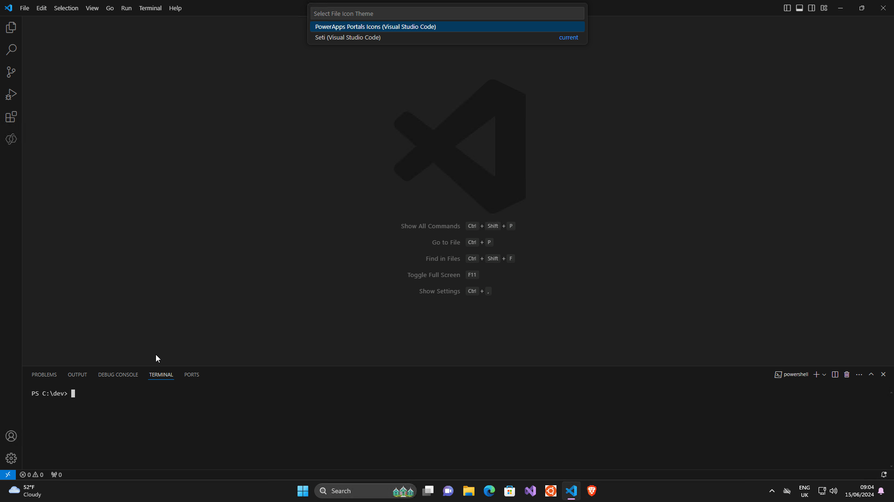

### Step 2: Create a working folder
Lets make ourselves a working folder

```PowerShell
mkdir control11
cd control11
```

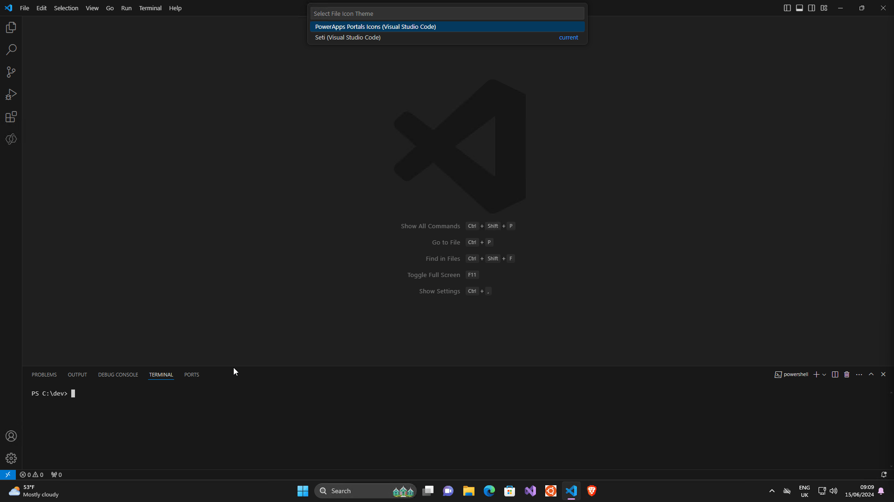


### Step 3: Initialise a blank component 

Lets just make sure we have Power Platform Tools Installed, and lets remind our-self what the parameters are we need to pass.

Open up the Terminal and enter
```PowerSell
pac pcf init help
```

Back will come the following
```PowerShell
Microsoft PowerPlatform CLI
Version: 1.31.6+g9147a23
Online documentation: https://aka.ms/PowerPlatformCLI
Feedback, Suggestions, Issues: https://github.com/microsoft/powerplatform-build-tools/discussions

Help:
Initializes a directory with a new Power Apps component framework project

Commands:
Usage: pac pcf init [--namespace] [--name] [--template] [--framework] [--outputDirectory] [--run-npm-install]

  --namespace                 The namespace for the component. (alias: -ns)
  --name                      The name for the component. (alias: -n)
  --template                  Choose a template for the component. (alias: -t)
                              Values: field, dataset
  --framework                 The rendering framework for control. The default value is 'none', which means HTML. (alias: -fw)
                              Values: none, react
  --outputDirectory           Output directory (alias: -o)
  --run-npm-install           Auto run 'npm install' after the control is created. The default value is 'false'. (alias: -npm)
```

For our first PCF we are building something simple, building a field template with no framework. 

```PowerShell
pac pcf init -n TechTweedieControl11 -ns TechTweedieControl11NS -t field
```

Then run npm install, which is going to bring everything down
```PowerShell
npm install
```

You may get some warnings, don't worry too much about them.

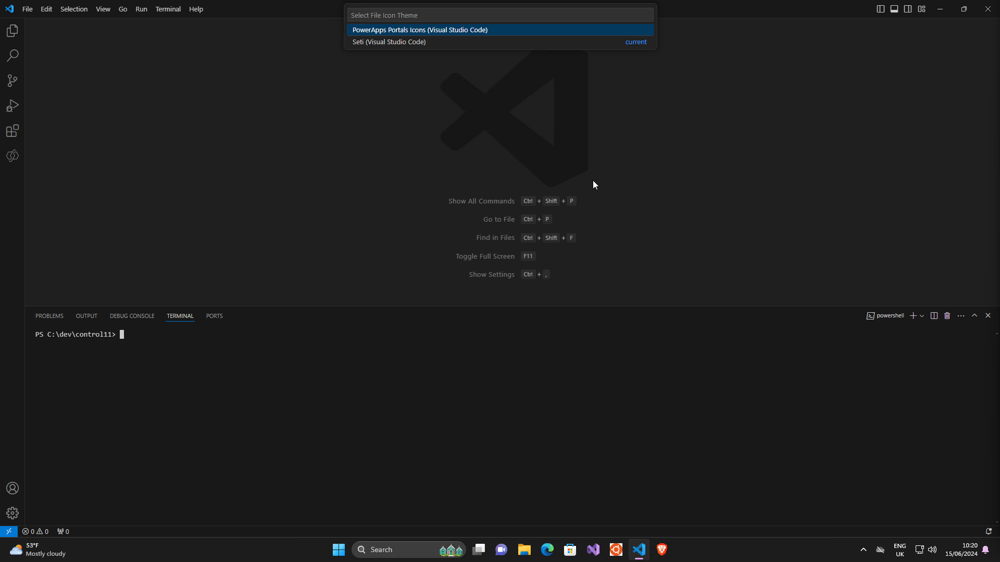

### Step 4: Lets go through the code

When we explore some of our files.

#### index.ts file

We find an index.ts file, inside our file we will find;
##### init
```TypeScript
 public init(context: ComponentFramework.Context<IInputs>, notifyOutputChanged: () => void, state: ComponentFramework.Dictionary, container:HTMLDivElement): void
    {
        // Add control initialization code
    }
```

This is our entry point to our component, this gets called in the lifecycle when our control is loaded.


##### updateView
This is called whenever any value in the property bag has changed. 
```TypeScript
    public updateView(context: ComponentFramework.Context<IInputs>): void
    {
        // Add code to update control view
    }
```

##### getOutputs
This is called to pass data back to dataverse.
```PowerShell
    public getOutputs(): IOutputs
    {
        return {};
    }
```

##### destroy 
We can use this to remove any components from the DOM tree once we have finished with out component. 
```TypeScript
    public destroy(): void
    {
        // Add code to cleanup control if necessary
    }
```


#### ControlManifest.Input.xml file
Tells us what the control is about, going through the elements. 

##### manifest/control element
This contains things like its display name and description. 

##### manifest/property element
The other things it 

![mainifest] (vmconnect_dSuy1MWaZo.gif)

### Step 5: Lets run it
We can run it to see what it looks like 
```PowerShell
npm start watch
```

As this runs it will tell us if there are any errors, this allows you to make changes on the vscode side

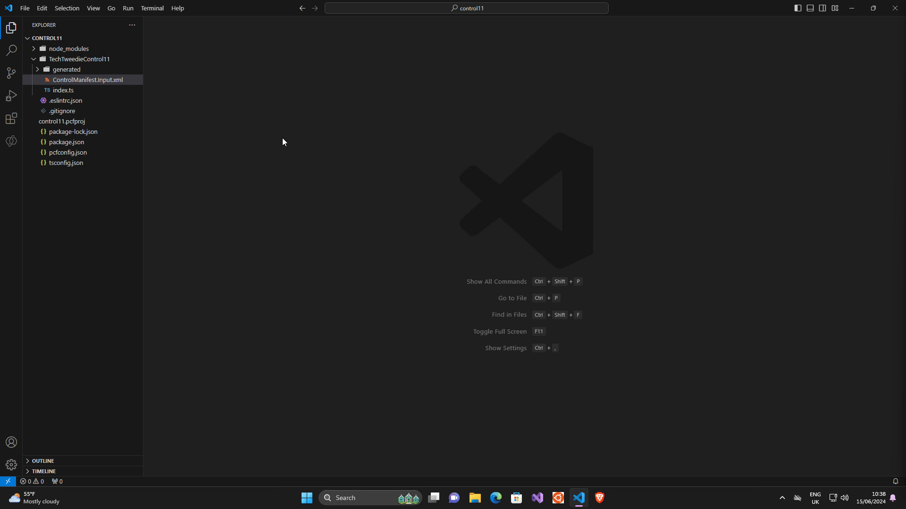

### Step 6: Lets add some console logs

Inside out index.ts file lets add two `console.log("text");`
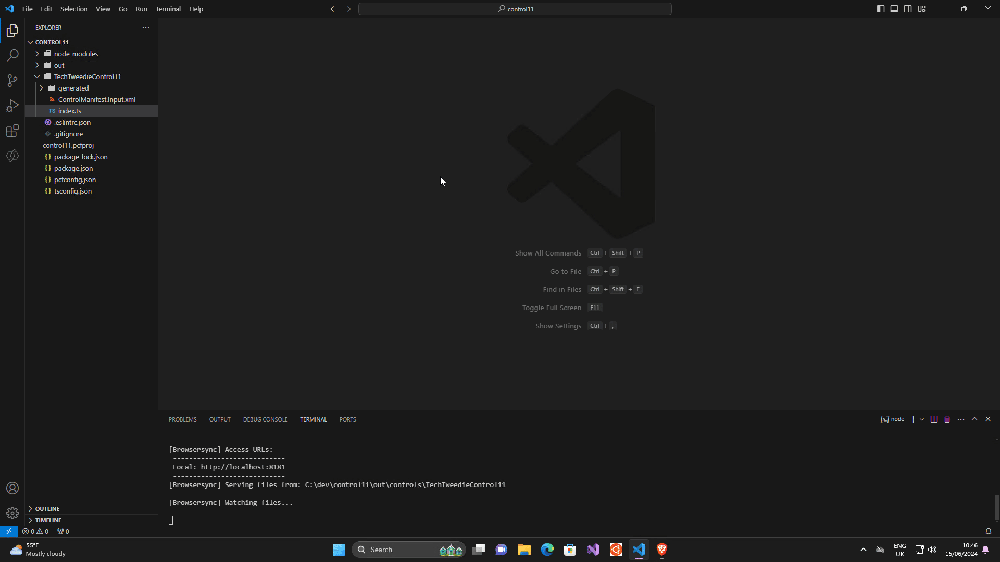

Lets see if we can access some data, lets console log out the context object.

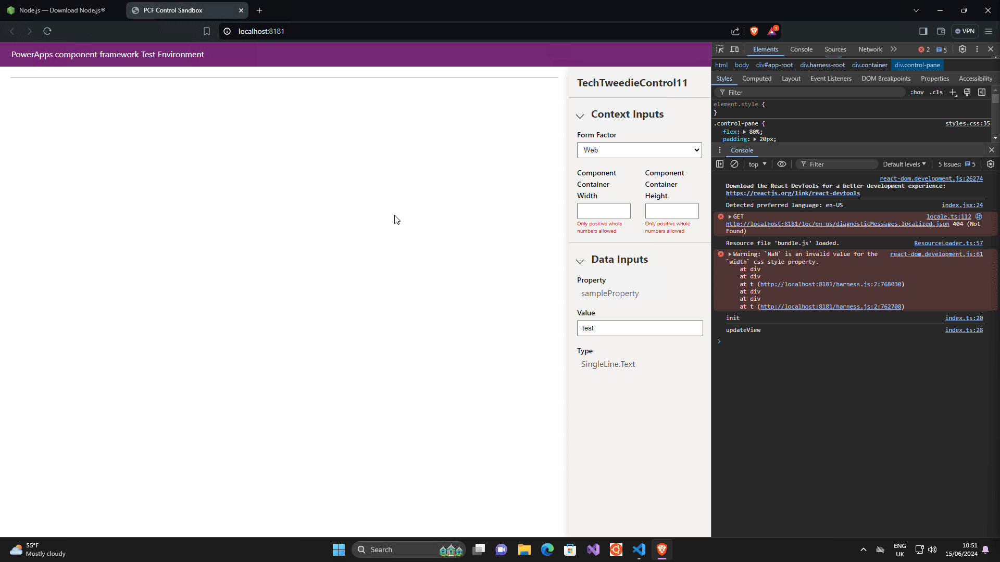

Exploring the object lets see if we can access the value. Exploring the object we can see we have parameters > sampleProperty >raw so lets give that a go.

Lets change out console log to `console.log(context.parameters.sampleProperty.raw);`

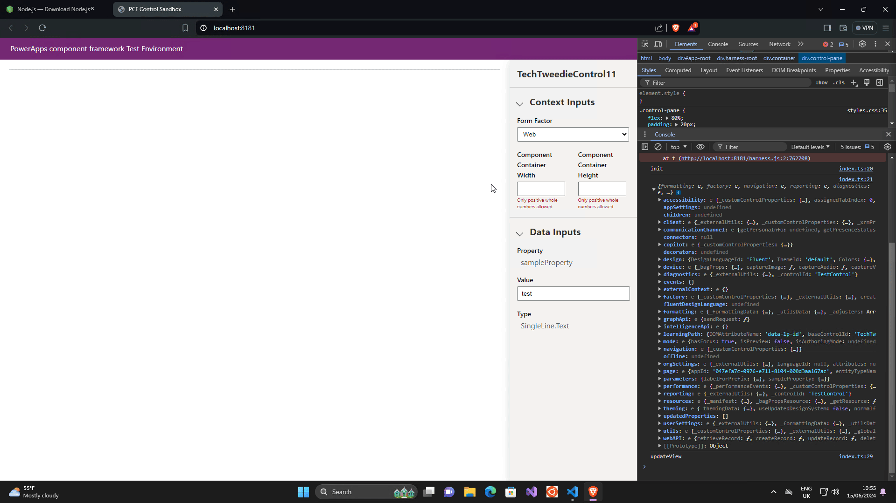

### Step 7: Lets create our input

This is where we need to create a property

```TypeScript
    private inputElement: HTMLInputElement;
```

We are then going to update our init so that it works from this new property
```TypeScript
        this.inputElement = document.createElement("input") as HTMLInputElement;

        this.inputElement.setAttribute("type", "text");

        this.inputElement.setAttribute("value", context.parameters.sampleProperty.raw || ""); //Get value of property, and in the case of a null value set it to an empoty string

        container.appendChild(this.inputElement);
```

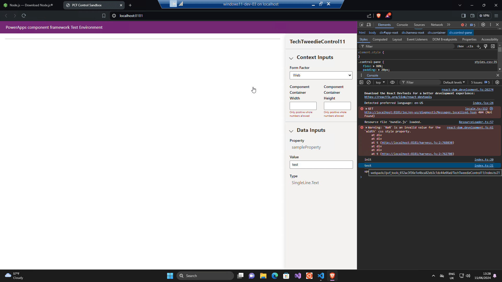

### Step 6: Get our values to update
This looks good, but now if the value of our sample property is updated, the value does not update. 
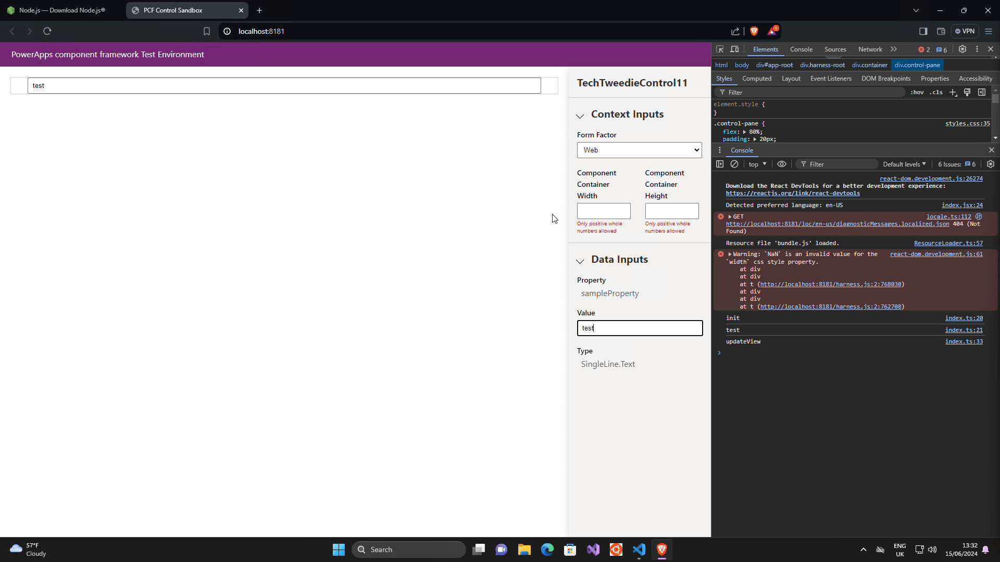

In order to sort this, we need update our input value when the `updateView` 
runs. We need to enter this line under our `updateView`

```TypeScript
this.inputElement.setAttribute("value", context.parameters.sampleProperty.raw || "");
```


However does it update the other way? In order to make this work we need to modify our TypeScript. 

First of all we need to edit our init, and add an event listener, 

```TypeScript
       // We are adding an event listner for when the input changes, and if that happens we are going to nofiy
this.inputElement.addEventListener("input", (event) =>{
notifyOutputChanged()
});
```

Then we go to the Get Outputs and update the return to be
```TypeScript
    public getOutputs(): IOutputs
    {
        return {
            sampleProperty: this.inputElement.value
        };
    }
```

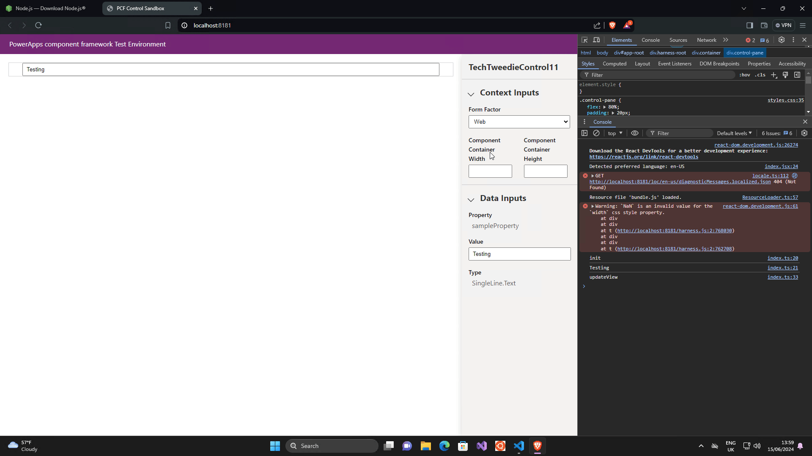


###  Step 7: Lets get our control in to our model driven app
With our control working let's control it to Dataverse, and place it on a form. 

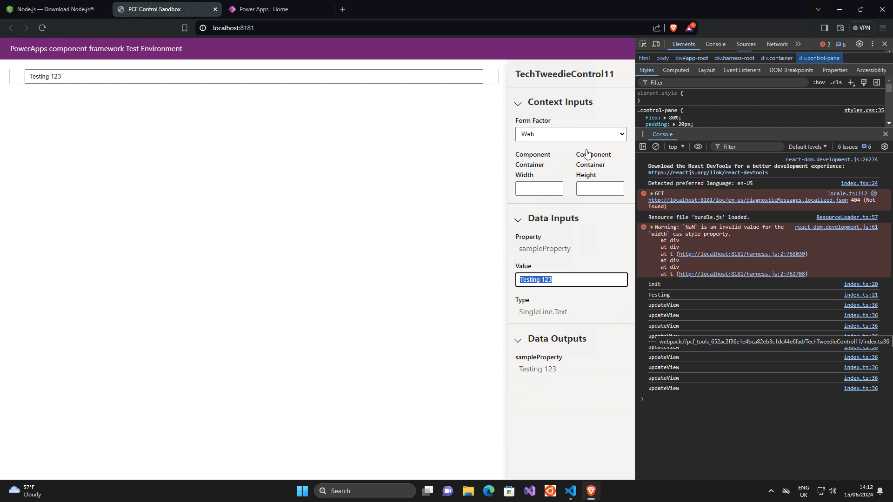

Lets attach it to a control
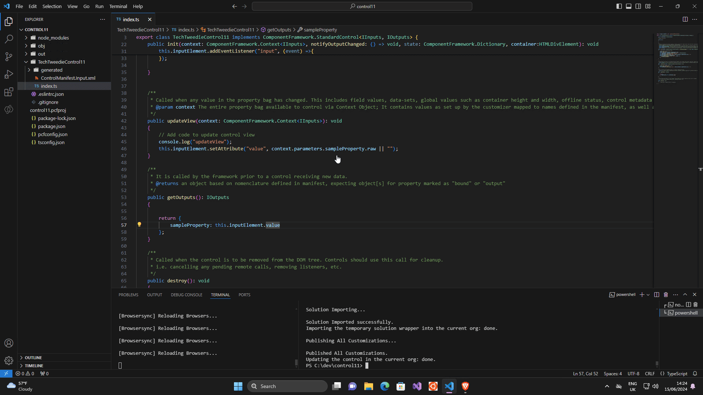


## Conclusion 

Congratulations! You've successfully built and tested your first Power Apps Component Framework (PCF) control. This journey, from setting up the environment to deploying your control in a model-driven app, has provided you with a solid foundation for creating more complex and customized components. By leveraging TypeScript and HTML, along with powerful tools like Visual Studio Code and the Power Platform Tools Extension, you now have the skills to extend your applications beyond the standard functionalities.

Remember, the true power of PCFs lies in their ability to enhance the user experience and meet specific business needs that out-of-the-box solutions may not cover. 

Thank you for following along, and happy coding! If you have any questions or need further assistance, feel free to reach out or watch the accompanying YouTube video for more detailed explanations and visuals. Keep pushing the boundaries of what's possible with Power Apps!