## Introduction
Recently, I was asked if it was possible to place a message at the top of every form and view across an entire Model-Driven App. This message would then open a Custom Page that would display more detail. In this Blog post, I explain how this can be achieved and what steps need to be taken.

For the purposes of this demo, we will call a custom help page from a command button. 

## Steps 

### Step 1: Create a Solution
Lets Create a new solution for this to sit within
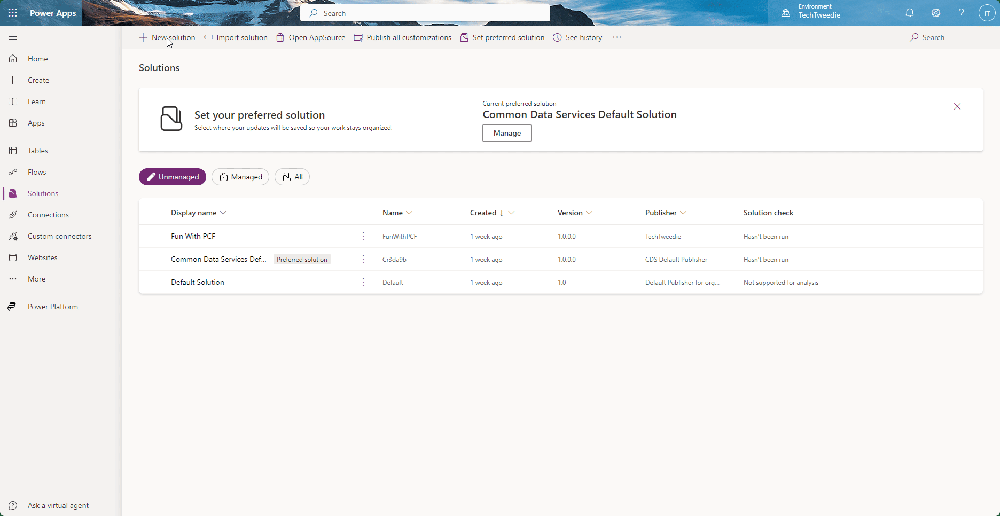

### Step 2: Custom Page
From here we now need to build a custom page
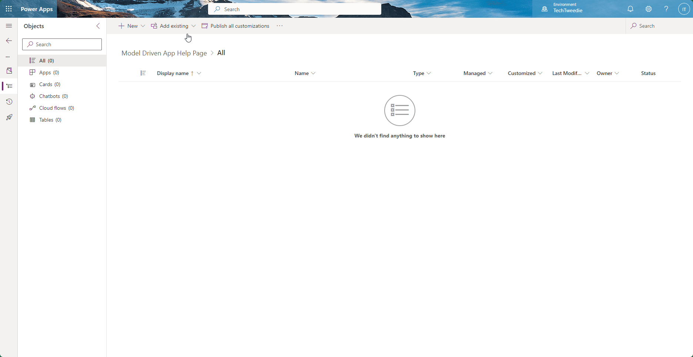

### Step 3: Our Model Driven App
So we can demonstrate this, we need to create a Model Driven App. 
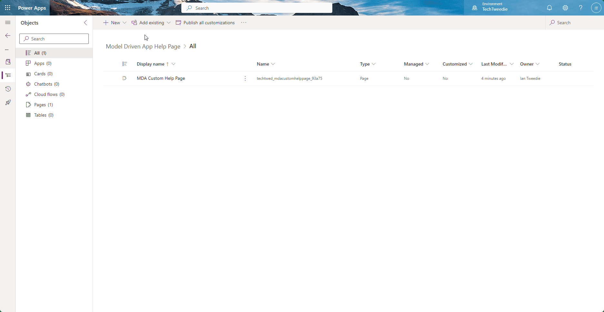

### Step 4: Custom commands
Lets save and Publish this Model Driven App, and then we can view where we are going to place our custom commands, for this demo they will call a **Custom Help Page**
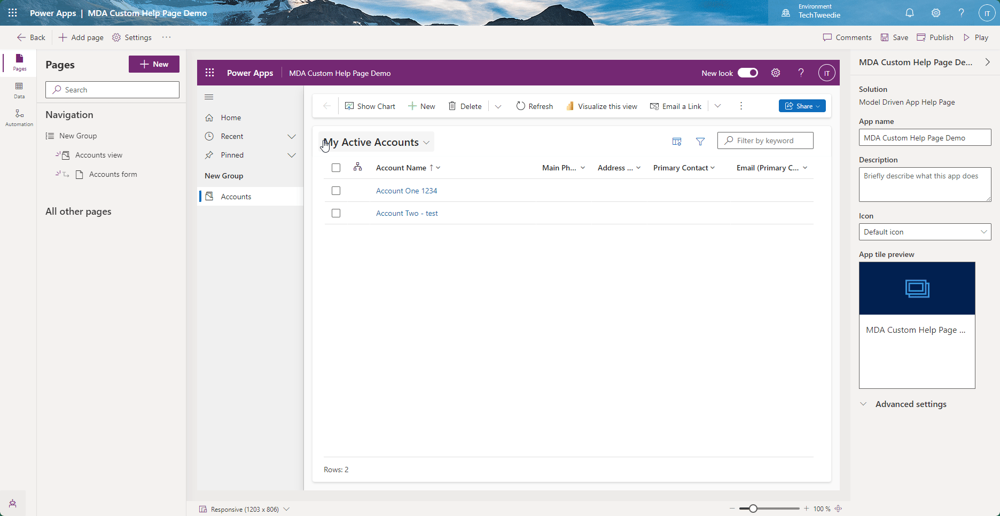

### Step 4: Custom page name
Next we need to grab the name of our power page, not display name. In our demo this is `techtwed_mdacustomhelppage_93a75`.
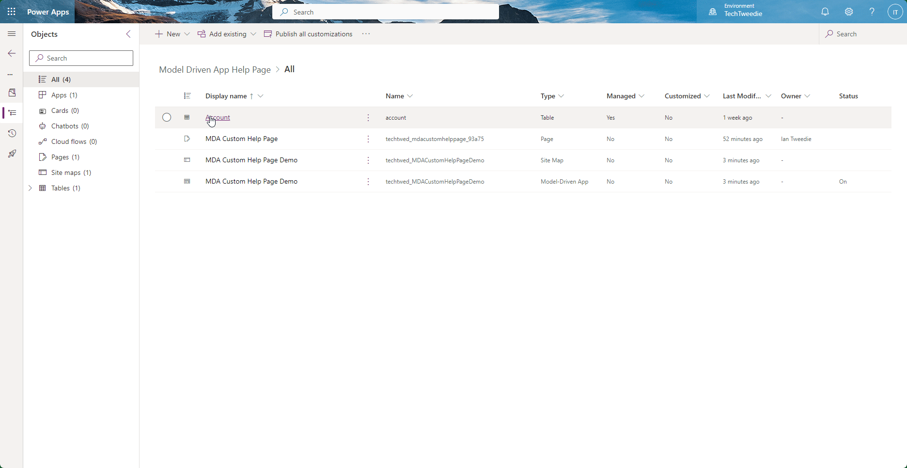

### Step 5: JavaScript
To create this we are going to use some JavaScript, where is some sample JavaScript we can adapt in order to create our button.

```JavaScript
function openCustomPage() {

    var pageInput = {
        pageType: "custom",
        name: "new_custompage", // The name of your custom page
        entityName: "account",  // The entity you want to open the custom page for, if applicable
        recordId: "00000000-0000-0000-0000-000000000000" // Optional, the ID of a specific record
    };

    var navigationOptions = {
        target: 2, // Opens the page in a dialog
        width: { value: 80, unit: "%" },
        height: { value: 80, unit: "%" },
        position: 1, // Center
        title: "Custom Help Page"
    };

    Xrm.Navigation.navigateTo(pageInput, navigationOptions).then(
         function success() {
             console.log("Navigation successful");
         },
         function error(error) {
             console.log("Navigation failed");
             console.error(error);
         }
    );
}
```

Lets create our JavaScript in VSCode called 
`openCustomHelpPage.js`. After dropping it in we need to make soem small changes to it. We need to remove 
```JavaScript 
       entityName: "account",  // The entity you want to open the custom page for, if applicable
        recordId: "00000000-0000-0000-0000-000000000000" // Optional, the ID of a specific record
```
as we dont need it, and update `title` with something appropriate, and `name` with the value from step 4.
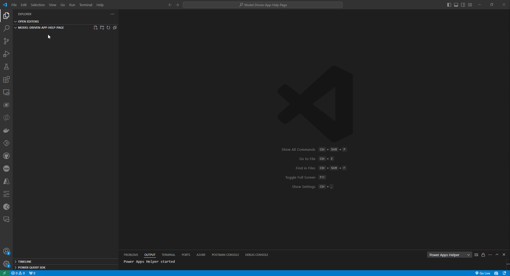

Finally, we need to update the name of our function. 
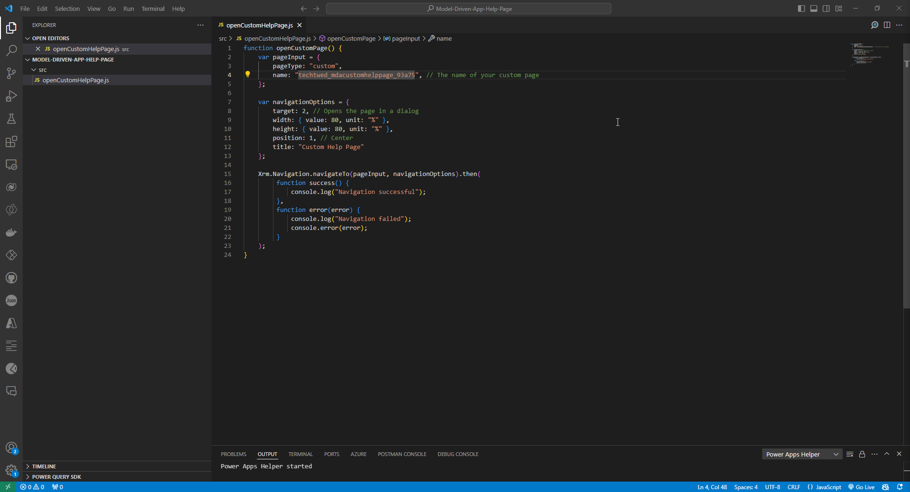

### Step 6: Create a Custom Command
Next, we need to create our Custom Command. For this example, we will do it in the **Accounts** table. Navigate to your solution **> Tables > Table Name > Commands**. 

Then Select **Main grid** and add a new button.
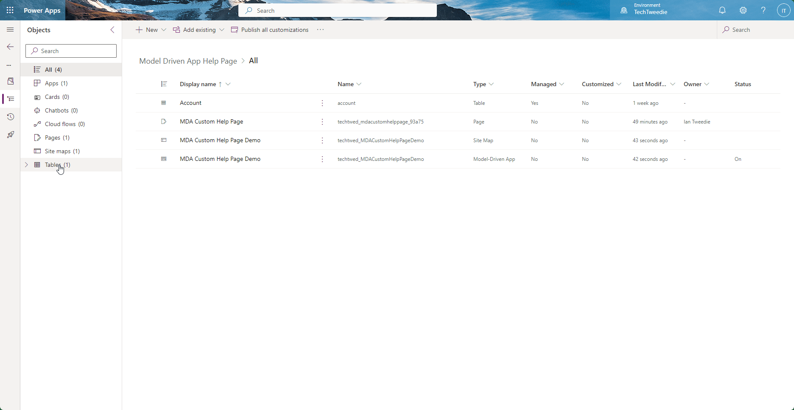

Then, we need to upload our JavaScript.
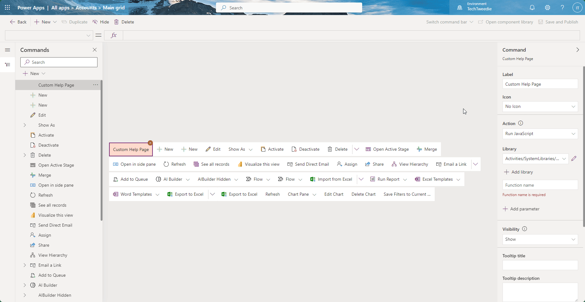

Finally lets configure our button to call our JavaScript function `openCustomHelpPage`.


Lets see if its worked
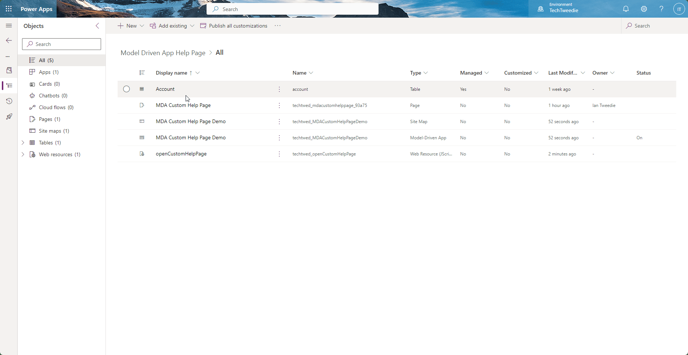

Lets now add the same page to the form
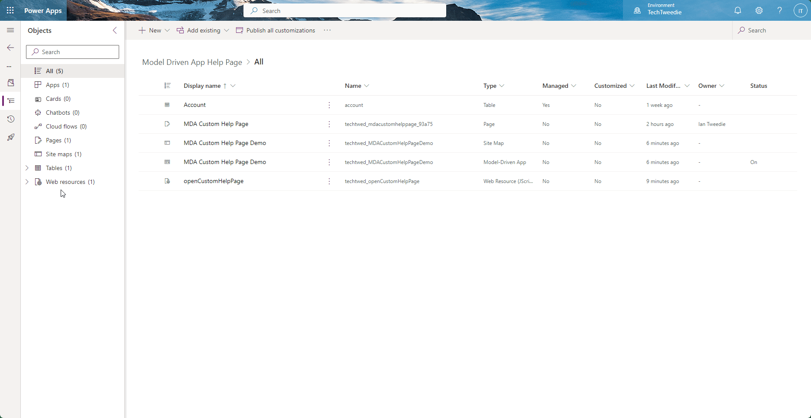

Lets test to see if that has worked
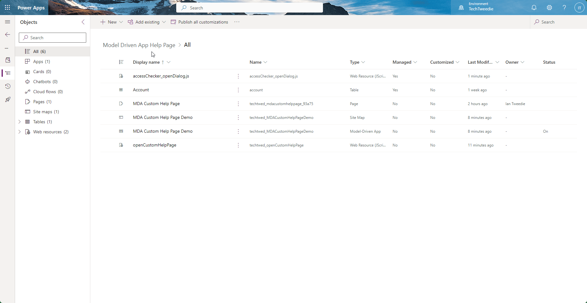

## Conclusion
By following these steps, you can add a message at the top of every form and view across your Model Driven App that opens a custom page. This approach enhances user experience by providing detailed help or information seamlessly integrated within your app.

For more tips and detailed guides, stay tuned to my blog. If you have any questions or need further assistance, feel free to reach out via my website.


