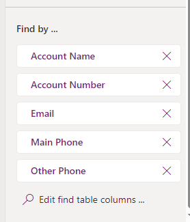

## Introduction

Often I find on dataverse projects users just want to search across a number of tables to find exactly what they want.

With the correct configurations, Dataverse search transforms this challenge into a walk in the park. In this blog post we’re are going to look at how you can tailor your Dataverse search indexes using the Quick Find View, ensuring that your searches are efficient but also relevant and quick.

>Note; the configuration for Power Pages is slightly different.

## The Essence of Quick Find View

At the heart of configuring what Dataverse indexes in searches lies the Quick Find View. This allows you to define defining searchable fields in Dataverse, your changes here directly impact what becomes searchable.

## Selecting Searchable Fields (Find Columns)

To configure fields to become searchable, select them as Find Columns. To select them just go to the Quick Find view for the table, and then locate the Find by section in the lower right hand corner of the screen. You can Edit the find table columns there.

However, it’s worth noting that not all fields are supported for Dataverse search. Currently only text fields, lookups, and option sets are in.

That being said; if you had the account table indexed and included the primary contact lookup. If the selected row in a look up was to change (e.g. the name of a primary contact in the contacts table) and the contact table itself was not in the index, the new value won't sync to the Dataverse search index.

## Currency Fields and Facets

If you need to return search results with the currency symbol? Make sure to include currency fields in your Find Columns. And for those looking to refine search results further, leverage facets. Dataverse search allows up to four facetable fields (from your View columns) as facets, adding a layer of filtering to aid users in narrowing down their search results. By default, the first four facetable fields in the Quick Find View for the selected table are displayed as facets when users search by using Dataverse search. At any time, you can only have four fields selected as facets.

## Syncing and Maintenance

Patience is key when it comes to updates. Changes to the Dataverse search configuration or searchable data might take a moment to reflect—up to 15 minutes for search services and potentially longer for a full sync, depending on your organization's size.

## Length and Indexed Attributes

Beware of the limits! The length of text in a table column set to Simple Search View must not exceed 1700 bytes. Exceed this, and you might face import errors. If you encounter this, consider reviewing and adjusting the length of your indexed attributes.

## Default Fields

Some fields automatically become part of the Dataverse search index—like **ownerid** and **name**. These common fields, once added to any table, are searchable across all entities, streamlining the search process.

## Key Takeaways

- **Flexibility**: The Quick Find View offers incredible flexibility in configuring your Dataverse search, allowing you to select precisely what gets indexed.
- **Considerations**: While flexibility is great, it's essential to be mindful of the fields and data types included in your Quick Find View, focusing on those that support efficient searching.
- **Patience for Updates**: Remember, changes to your configuration may take some time to reflect in the search results.
- **Limits and Lengths**: Keep an eye on the limits, especially with indexed attributes to avoid errors.

By carefully selecting what Dataverse indexes in its searches, you can significantly enhance the search experience within your organization. This doesn’t just make finding information easier but transforms the way you navigate and utilize your data in Dataverse. Happy indexing, and here’s to searches that bring exactly what you’re looking for, right to your fingertips!