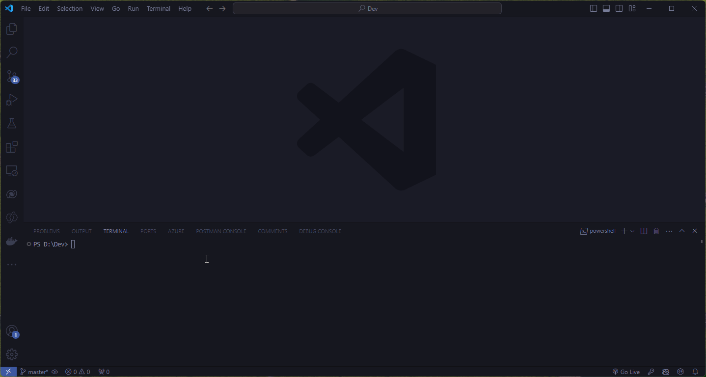
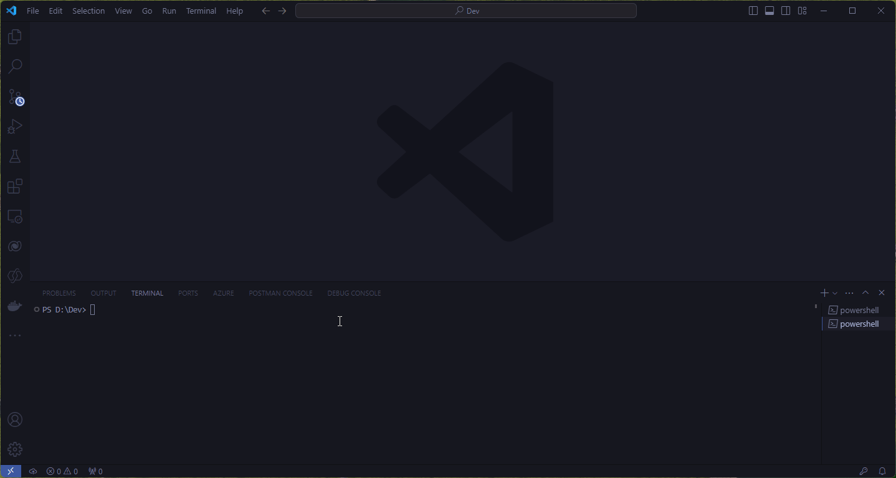

## Introduction

Hugo is a open-source static site generator, designed for speed and flexibility, making it an excellent choice when creating modern websites, blogs, and documentation. In this guide, we'll walk you through the steps to install Hugo on your Windows 11 machine.
<!--more-->
**You can watch the accompanying YouTube video here**


## **Step 1:** Download Hugo

You can download Hugo using [`winget`](https://learn.microsoft.com/en-us/windows/package-manager/), Microsoft's official free and open-source package manager for windows. For this, lets go to Visual Studio code, open up PowerShell and run the below command. 

```PowerShell
winget install Hugo.Hugo.Extended
```





Then restart your machine
## Step 2: Check that Hugo is available

```PowerShell
hugo version
```




### If it is not available, then you will need to add it to your environment variables. 
To make Hugo accessible from the command line, you need to add it to your system’s PATH.

1. Open the Start Menu and type "Environment Variables."
2. Click on "Edit the system environment variables."
3. In the System Properties window, click on the "Environment Variables..." button.
4. In the Environment Variables window, find the "Path" variable under "System variables" and click "Edit."
5. Click "New" and enter the path to the directory where you extracted Hugo (e.g., `C:\path\to\hugo\directory`).
6. Click "OK" to close all the windows.

## Step 3: Verify Installation

To confirm that Hugo has been installed correctly, open Command Prompt and type:

```sh
hugo version
```

You should see a message displaying the version of Hugo that you installed.

## Step 4: Create Your First Site

Now that Hugo is installed, you can create your first site.

### 1. Open Command Prompt.
Open Command Prompt, navigate to the directory where you want to create your new site.

### 2. Run the following command to create a new site:

```sh
hugo new site mynewsite
```

### 3. Navigate into your new site directory:

```sh
cd mynewsite
```

### 4. Initialize a new Git repository (optional but recommended):

```sh
git init
```

### 5. Add a theme to your site. 
You can find many themes on the [Hugo Themes website](https://themes.gohugo.io/). For example, to add the PaperMod theme:
```sh
git submodule add --depth=1 https://github.com/adityatelange/hugo-PaperMod.git themes/PaperMod
```

### 6. Then edit your config file
Navigate to the hugo.toml file to add in your theme information by adding the following line
```toml
theme = 'PaperMod'
```

### 7. Add a post
Finally create some new posts by running the following command 

```bash
hugo new content/posts/post_one.md
hugo new content/posts/post_two.md
```
## Step 5: Update your content

Inside your content folder, locate your posts, update them and set draft status to false. 

**Content for Hugo Sample Post:**

```
# Welcome to Hugo!
Hugo is a fast and flexible static site generator built with love by [bep](https://github.com/bep), [spf13](https://github.com/spf13), and [friends](https://github.com/gohugoio/hugo/graphs/contributors). Below is a demonstration of various features you can use in your Hugo site.

## Headings

# Heading 1
## Heading 2
### Heading 3
#### Heading 4
##### Heading 5
###### Heading 6

## Text Formatting
**Bold text**
*Italic text*
~~Strikethrough~~
> Blockquote
Inline code: `var example = true`

## Links
[Hugo's official website](https://gohugo.io/)

## Lists
### Unordered List
- Item 1
  - Subitem 1
  - Subitem 2
- Item 2

### Ordered List

1. First item
2. Second item
   1. Subitem 1
   2. Subitem 2

## Images


## Code Blocks
### JavaScript
	```javascript
	console.log("Hello, Hugo!");
	```

### Python
	```python
	def hello_hugo():
		print("Hello, Hugo!")
	```

## Tables
| Syntax    | Description |
|-----------|-------------|
| Header    | Title       |
| Paragraph | Text        |

## Shortcodes
### Highlight

// This is a Go code block
package main
import "fmt"
func main() {
    fmt.Println("Hello, Hugo!")
}


### Figure


```


## Step 6: Build and Serve Your Site

To see your site in action, you need to build and serve it.

1. Run the following command to start the Hugo server:

```sh
hugo server -D
```

2. Open your web browser and go to `http://localhost:1313`. You should see your new Hugo site.

## Conclusion

Congratulations! You've successfully installed Hugo on your Windows 11 machine and created your first static site. Hugo's speed and flexibility make it an excellent choice for building a wide range of websites, from simple blogs to complex company sites.

If you have any questions or run into any issues, the Hugo community is very active and can be a great resource. Happy building!
