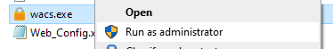

<!--more-->

## Introduction

Do you want to deploy Power Pages on a custom domain securely without the need to buy a custom certificate? In this blog post, I’m going to show you how to do this quickly and easily acquire a PFX certificate that you can then use to deploy to Power Pages. 

## Pre-requisite

This is a brilliant tool for generating SSL, and it is simple to use and quick to deploy.

You can download the tool here; https://www.win-acme.com/

## Steps

Make sure you run the wacs.exe as an administrator

We are going to make a certificate with **full options**

Then we are going to use **manual input**

Next, we are going to create **verification records manually** on our DNS server

Then choose **RSA key**

Then we want to create a PFX archive

Pop in the location where you would like to store the PFX certificate

Create a password

This is a short lived cert, so we **don’t want to save** it in the vault

We **don’t want to** take any additional steps

We **don’t want to** store it anywhere else

It then pops up with the TXT DNS record you need to add. This will need to be added at your registrar.

Then remove the record.

If you get the error, **WindowsCryptographicException** try running the programme as administrator.

You should have your PFX file now, if you need a hand please get in touch and we can arrange some help.