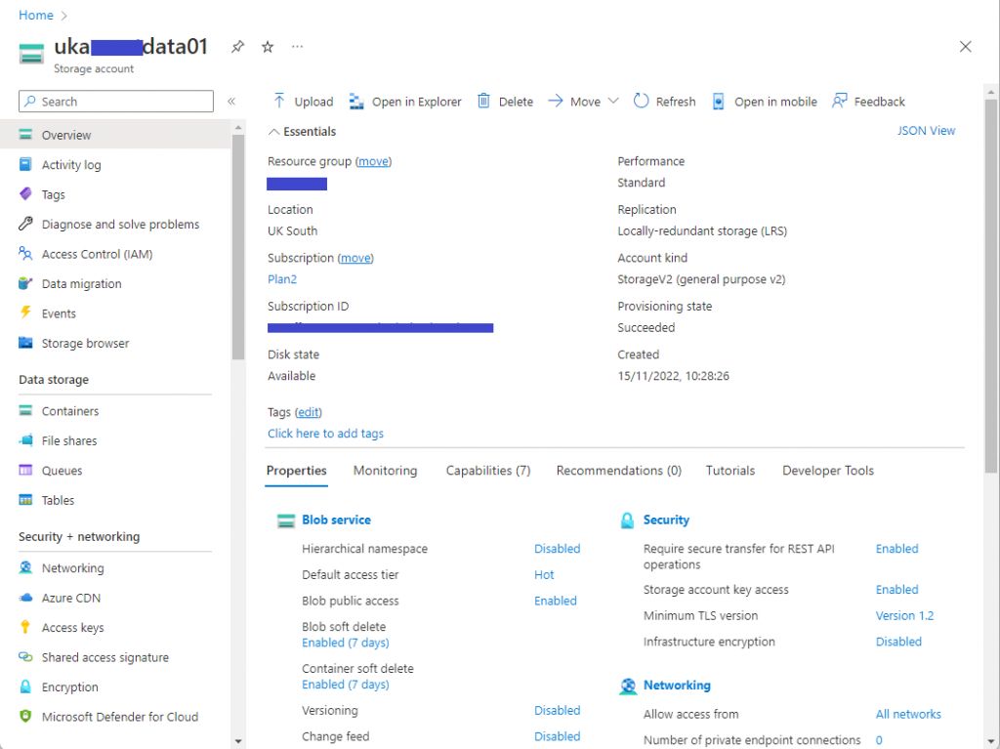
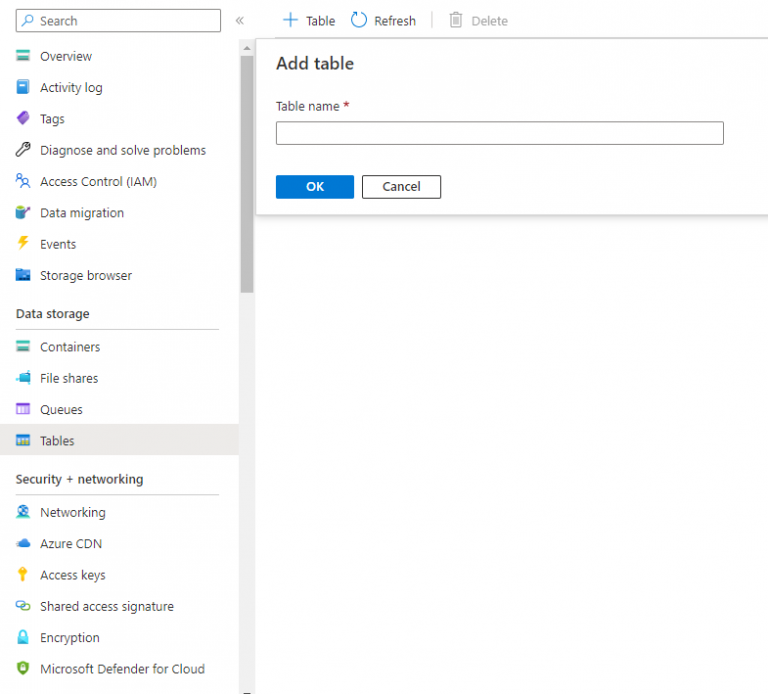
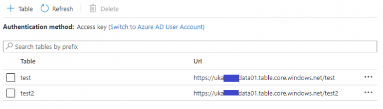
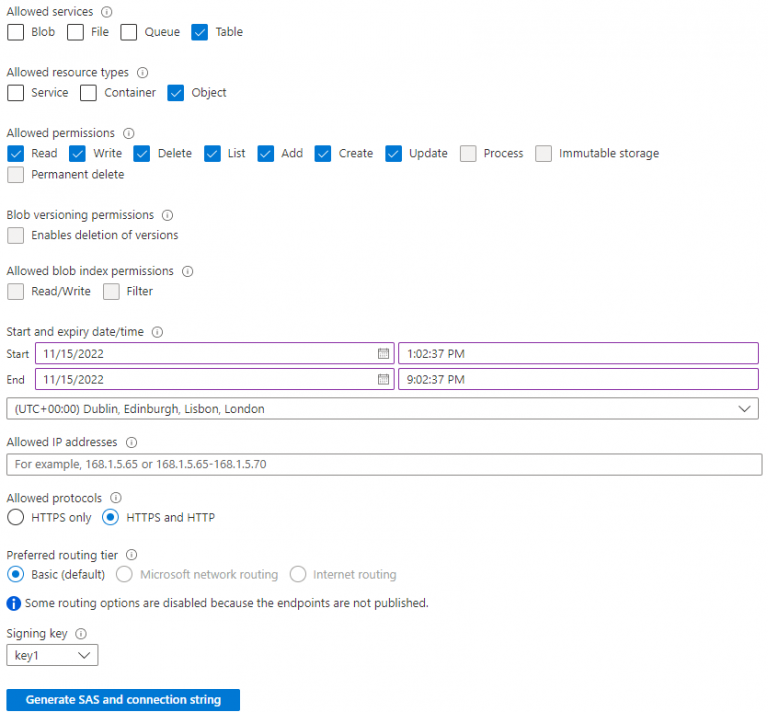
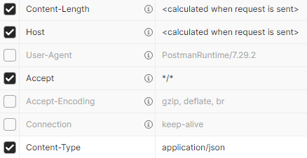
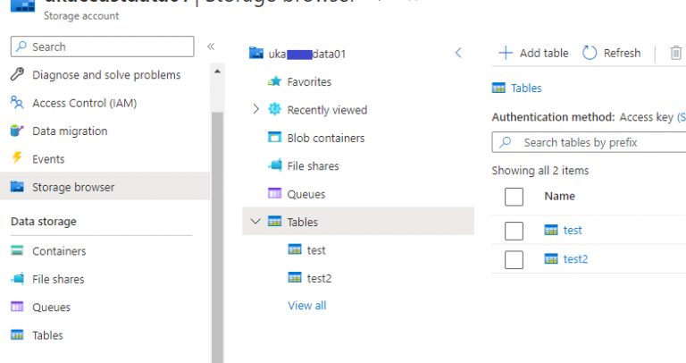
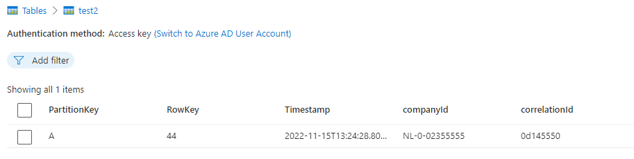

<!--more-->

This post is an example of how I posted data to Azure Table storage from Postman.

## Prerequisite

- You have access to Postman
- You have an Azure Storage account

## Steps

1. Go to your Storage Account  




2. Click on **Tables**, and then click on **Add table**



3. Add table to Azure Storage Account

	You should now have a table, in my example these are called `test` and `test2`.



4. Next, generate a **shared access signature (SAS)**, which is a URI that grants restricted access. Generate a SAS and connection string as shown below.



5. Click on **Generate SAS and connection string** and leave the generated strings on screen, we will need them later.

6. Now go to **Postman**, From postman we are going to do an **insert or/and replace** request.

	**Request URL:** `https://<<StorageAccountName>>.table.core.windows.net/<<TableName>>(PartitionKey=’myPartitionKey’, RowKey=’myRowKey’)`  
See example below.

```
https://ukaxxxdata01.table.core.windows.net/test2(PartitionKey='A', RowKey='44')
```

7. Then go back to the screen where you **Generated your SAS** and look down until you get to **SAS token**.

	Copy the value, and paste it after the **request URL** so it forms one ling string. See example below.

```
https://ukaxxxdata01.table.core.windows.net/test2(PartitionKey='A', RowKey='44')?sv=2021-06-08&ss=t&srt=o&sp=rwdlacu&se=2022-11-15T21:02:37Z&st=2022-11-15T13:02:37Z&sip=1.1.1.1&spr=https,http&sig=49MrnoRgsbL9bvzIr%2BrEfxpQP3MAAe4rbc1O44NzcHc%3D
```

**Method:** PUT

Under **Body** choose **raw** and then **JSON** from the drop-down menu. Then enter in some sample JSON.

```
{
  "correlationId": "0d145550",
  "companyId": "NL-0-02355555",
  "dateOfOrder": "2021-02-04T09:33:36.166Z",
  "language": "en",
  "userId": "10555"
}
```

Under **Headers** enter in as detailed below:



8. Then press **Send**, and you should get a **204 No Content** response.

## Check it works

To check it works we go to storage browser, I will do this in Azure.



Click on the table you just posted to, and then you should see the data you have just sent to the table.



