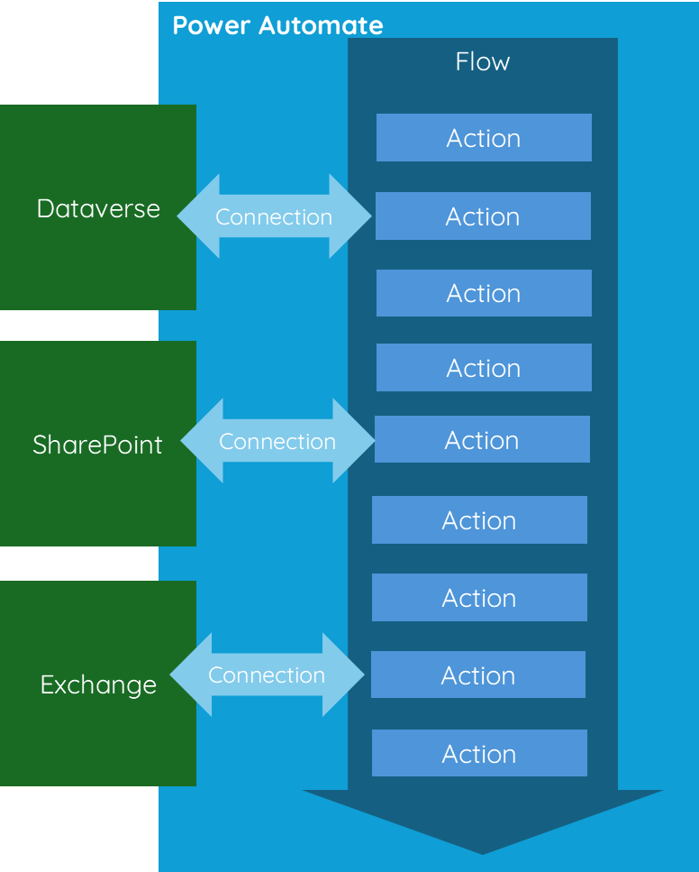

<!--more-->

## Introduction

Power Automate is a wonderful tool, but there is a world of difference between building something for personal productivity and utilising this amazing low-code tool for production, where an important business application will rely on it.

When considering a workload like this, we need to make it easier to manage and troubleshoot, ensure reliability, and prioritise security. Finally, if the worst were to happen, such as some credentials becoming leaked or an endpoint being compromised, how can we configure this so that damage is limited?

## What can we do

There is no perfect cookie-size answer that fits all, and it would be impossible to try to conceive every situation that will occur. It’s also important to exercise judgment when drafting the guidelines for your project and ensure that each one has a purpose and reduces perceived risk.  

## Suggestions

These are some of my suggested guidelines, based on my previous experience;

### Power Automate Flows Ownership

Consider utilising a service account to own and manage Power Automate flows; this service account should have no permissions to the data workloads and should just purely be there to manage and own the Power Automate Flows. 

### In development environments

In development environments, create connections and link them to connection references using a service account, not from a random developer’s single-user account. Then, share them with the rest of the development team. 

The benefit of doing this is that your developers do not need to handle the credentials, reducing the risks of leaks. Additionally, your development environment remains clean, and it prevents every developer from having their own set of connection references to the same place. When it comes to deploying through a pipeline, this also speeds up the process of mapping connection references in your settings deployment file.

### Use solutions

Although connections themselves are not solution aware, connection references are, and should always be created inside of a solution. 

### Use Application Users for Dataverse

When interacting with Dataverse from Power Automate Flow, utilise application registration, and application users. You can then permission these application users appropriately for the actions they should be performing, utilising the principle of least privileged. 

### Use Application Users in Dataverse to help with Troubleshooting

It can be really tough to figure out which automation caused a value to change, especially when all the Power Automate flows are running under the same user account. It's even harder if that user is one of your everyday users.

Therefore, consider creating different application users for various types of activities. 

The usernames will then appear on the records within Dataverse under "created by", "modified by", or in the audit history if it's switched on. 

### Use App Registrations whenever possible

Use application registrations instead of a service account username and password for a specific service when possible. This helps prevent access issues when the multi-factor authentication (MFA) needs to be renewed or when all refresh tokens are cancelled due to policy changes. Additionally, it can save on licensing costs. This approach is especially helpful when accessing Entra, SharePoint, and Exchange.

### Balanced approach and Damage limitation

We need to acknowledge the potential for a breach and prepare to minimise the damage. However, our response should be practical and take into account the level of risk. It's important to strike a balance between creating numerous separate "users" (application registrations/service accounts, etc.) for every task, which would be difficult to manage, and relying on a single highly privileged account.

**Don’t** - set up one service account and let it run all of your power automate flows, and have permissions to all of the workloads that your flows are interactive with. 

**Don’t** - create a different application user/app registration for each connection on each flow unless you absolutely have to. It will become a management and maintenance nightmare.

**Do** - have a balanced approach, split up the accounts that are interacting with the workload and the account that is used to manage 

## Final thoughts

When considering your approach think carefully about what the risk really is, what would be the impact, and find the balance. In this some useful questions to ask are;

**Assume breach** - How would you design the connection structure to limit damage if one were to be breached?

**Least privilege** - What is the minimum practical level of security you could grant to each connection?

**Easy to understand** - How can you make it as easy as possible to understand for the next person? What could you do to help them troubleshoot future problems?

## Continual Improvement

It's important to keep in mind that the digital landscape, along with digital tools and security threats, is constantly changing. It's crucial to stay updated on the latest best practices, updates, and potential vulnerabilities. Regularly review and improve your processes, involve your team in discussions as many brains are better than one. By fostering a culture of continuous improvement and adaptation, you can better safeguard your business applications and ensure that your Power Automate flows remain robust, secure, and efficient.