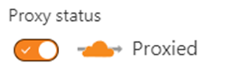
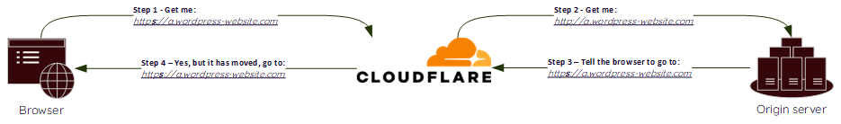

<!--more-->

## Introduction

I recently set up a new WordPress website for a friend. It was late one evening, and I was in a bit of a rush; as with many people online, I chose to use Cloudflare to protect the website.

However, problems arose after setting up the WordPress website when I configured the SSL/TLS side of things.

I switched on Cloudflare’s proxy as normal.

So far so good.

Then I continued to edit the site before handing it over to my friend; however, I noticed I was getting load errors.

Checking some of the settings, I noticed that both the _WordPress Address (URL)_ and _Site Address (URL)_ were set to `http://a.wordpress-website.com`. I changed them to `https://a.wordpress-website.com`. To my annoyance, when I did, I was met with ERR_TOO_MANY_REDIRECTS.

This error occurs when a webpage gets stuck in a loop of continuous redirects, making it impossible to access the desired content.

What had I done wrong?  In this post, I run through the steps I took to understand what happened and how I fixed it.

## Some of the reasons why this problem can occur

1. **Something local:** It could be because of some issue local to my device, something browser/client-based.
2. **Redirect loops:** This is where `https://a.wordpress-website.com` points to `https://b.wordpress-website.com`, which then, in turn points the user back to `https://a.wordpress-website.com`
3. **A misconfiguration SSL/TLS Encryption mode:** Your domain’s SSL/TLS Encryption mode controls how Cloudflare connects to your origin server and how SSL certificates presented by your origin will be validated.
4. **Various Edge Certificates settings:**  If you enable Always Use HTTPS for your domain, Cloudflare will automatically redirect all HTTP requests to HTTPS for every subdomain and host in your application.

However, first, let’s take a step back so we can all understand what communication is going on here.

In our scenario, the browser is going to Cloudflare, and Cloudflare is then going to the Origin Server which is where the WordPress Website is.

## So, how did I approach the problem?

### Something Local

Before diving too far into solutions, it’s essential to understand if we have a real problem or if this results from some cache, DNS, or other browser thing. This can happen when bringing any site online.

So, I cleared all my cache, flushed my DNS, restarted, and nothing changed.

Next on my list was, is it just me, how about if I use a different device, there might be something specific just to this client? So, I fired up Windows Sandbox (see my post on how to set this up here), but no luck; pick up my iPhone, still no luck, same problem.

So, it’s not just me.

### Redirect loops

Next, I checked the WordPress settings to see if any redirect loops or plugins were causing the issue. After disabling everything, testing, and seeing if the problem was still there, I was convinced that I checked through the WordPress settings.

Everything looked correct, so I thought, what if I change the setting back for both the _WordPress Address (URL)_ and _Site Address (URL)_. Sure, enough of the problem was resolved. However, my page load errors returned.

I thought I would try switching off the Cloudflare proxy for this hostname and setting the site URL back to https. No error. Switched Cloudflare back on. The redirect loop came back.

I had established that I could not have Cloudflare proxy on and have the site URLs set to HTTPS. This didn’t seem right; I had done it this way before, but what was different now?

### Diving into the problem

I knew where the problem was.

1. One of the settings in Cloudflare was causing Cloudflare to make an HTTP request to the origin server.
2. The origin server was redirecting this request to HTTPS.

As you can see step 2 does not make a HTTPS request to the origin.

I needed to find the setting Cloudflare that handles the connection between Cloudflare and the Origin server.

### The solution

Settings to control how Cloudflare connects to the origin server are stored under the dashboard for your domain, under SSL/TLS. See this useful [article](https://developers.cloudflare.com/ssl/origin-configuration/ssl-modes/). 

Reading through the options, I see that for one of the options;

> [Flexible](https://developers.cloudflare.com/ssl/origin-configuration/ssl-modes/flexible/): Setting your encryption mode to **Flexible** makes your site partially secure. Cloudflare allows HTTPS connections between your visitor and Cloudflare, but all connections between Cloudflare and your origin are made through HTTP. As a result, an SSL certificate is not required on your origin.
> 
> From: https://developers.cloudflare.com/ssl/origin-configuration/ssl-modes/

My site was configured in flexible mode, an easy fix, but an option I had clearly missed.

### Tips and Best Practices

Thinking about what I could do to avoid this problem in the future, a few thoughts come to mind.