## Introduction

Have you ever wondered if you can use Environment Variables in a PowerFX button, how to create a custom email link button in the command bar of your Power Apps model-driven application using environment variables and Power FX? Luckily, Power Apps has recently made it possible to achieve this. With the help of Power FX, which is the same language used in canvas app development, anyone can efficiently customise their app’s command bar without needing prior knowledge of JavaScript or the Ribbon Workbench.

In this blog post, we’ll guide you through the steps involved in customising the command bar of your Power Apps model-driven app. You’ll learn how to use environment variables to create a button that dynamically generates email links. This capability provides users with greater control over their app interfaces and streamlines their interactions, making operations within the app more effective and tailored to specific needs.

## Assumptions

- You are in a Dataverse environment.
- You are in a solution.
- You have a model-driven app already in that solution.
- You have a table you would like to email records on.

## Create environment variables

Navigate to your solution, select **All** and then from the menu at the top, select **New**, then choose **More > Environment variable**.

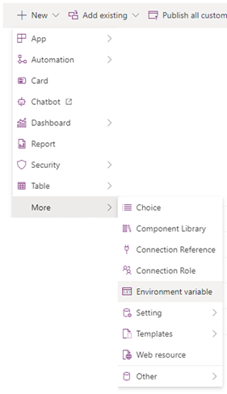

Then, fill in the details of our new environment variable. We will use these values later.

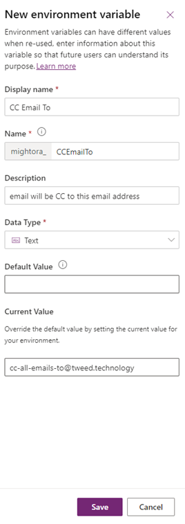

For my example, I created three environment variables, all relating to the email we will send.

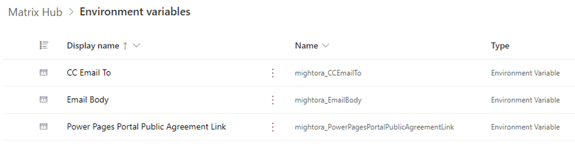

## Command Bar Customisation

### Navigate to your Model Driven App

Within your solution, navigate to the model-driven app, and open it up in edit mode.

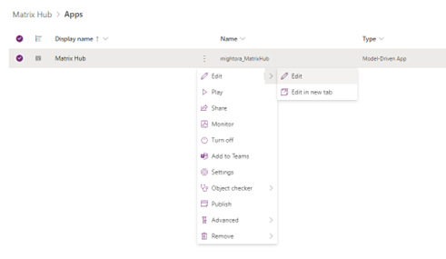

### Navigate to the command bar editor

Find the **table** you which to add the custom command to, and then click on the ellipsis (three dots), then choose **Edit command bar.**

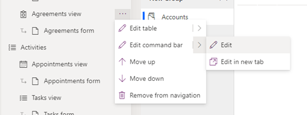

You will then be asked which **command bar** you wish to edit, choose **Main grid**.

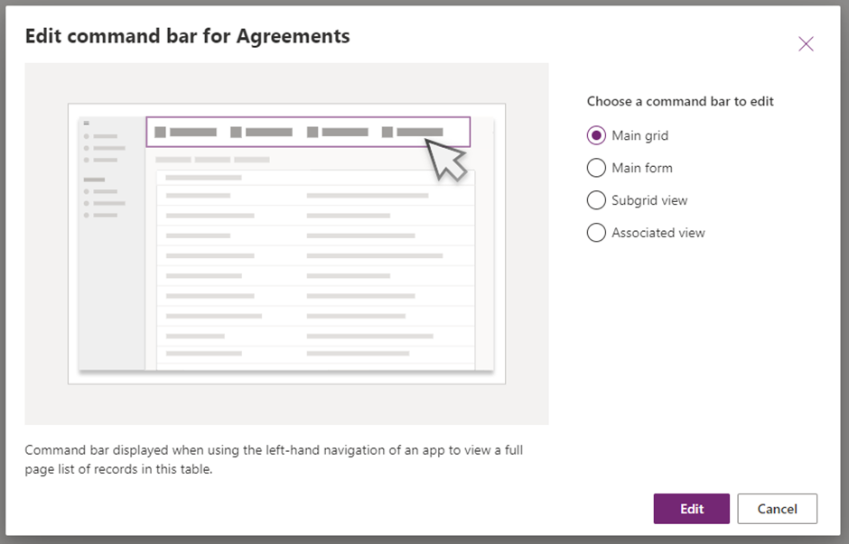

### Create your new button

Choose **New**, and then select Command

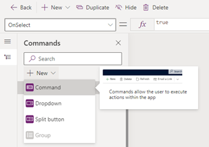

This will place an object called NewCommand on the command bar. You can drag this to any position you want.

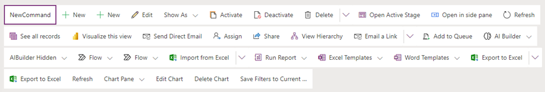

With the command selected choose, you will see on the **Right-Hand** side of the screen a number of options available for you to select.

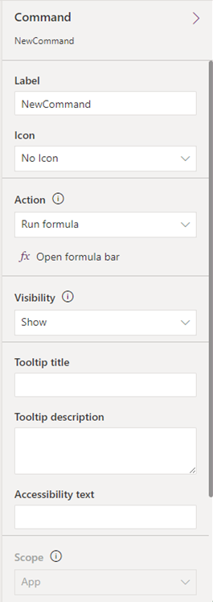

For this demonstration, I am using the following values

- **Label:** Email Record
- **Icon:** Use Icon, Email
- **Action:** Run formula (at this point, if you have not already you will be asked to create a component library)
- **Visibility:** Show on condition form formula
- **Tooltip title:** Clone record(s)
- **Tooltip description:** This button clones all of the selected records
- **Accessibility text:** Press this button to clone selected records

### Enable Environment Variables in the Component Library

Save and Publish your changes so far.

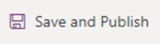

Then we need to move to the component library.

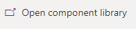

Then you will be presented with a screen vert similar to one used for canvas apps.

From this screen you need to press on **Add data** and then add both **Environment Variable Definitions** and **Environment Variable Values** tables from Dataverse.

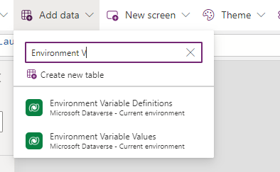

### Configure our new button

In the top left-hand corner, you will see a drop-down box; this allows you to select either **Visible** or **OnSelect**.

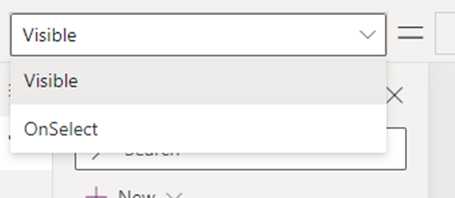

With **Visible** chosen, copy and paste the following code:

```PowerFX
// This is going to show the button as soon as an item is selected.
!IsEmpty(Self.Selected.AllItems)
```

This command is essentially verifying that there are items currently selected. If any items are selected, the result will be **true**, indicating that the list of selected items is not empty. Conversely, if no items are selected, the result will be **false**, signifying that the list is empty.

With **OnSelect** chosen, copy and paste the following code:

```PowerFX
// We are going to iterate over all items that have been selected in the Table.
ForAll(
    Self.Selected.AllItems,
    Patch(
        Agreements,
        Defaults(Agreements),
        {Name: "CLONE - " & Text(Now(), "[$-en-US]yyyy-mm-dd hh:mm:ss") & " - " & ThisRecord.Name}
    )
);
Notify("The records selected have been cloned.")
```

Save, Publish, and Test

Now that we have finished our component, press on Save and Publish


Then navigate back to your Model Driven App, and **Play** the app

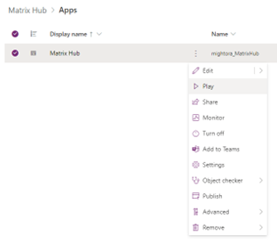

Once it opens, press **Ctrl + F5** to refresh your browser. Then you should see the Clone Record button in the **command bar** at the top of the screen.

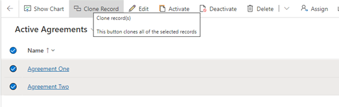

When we press on the button we get the following result.

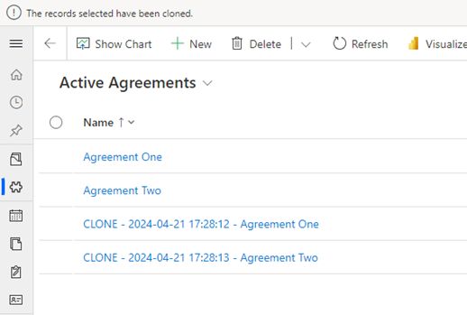

## Frequently Asked Questions

**1. What permissions are needed to implement the custom PowerFX button?**  
To implement a custom PowerFX button in a model-driven app, you need to have the necessary permissions to edit the app within Microsoft PowerApps. Typically, this means you should be either an app maker or a system administrator within your environment.

**2. Can the cloning process handle related records?**  
Yes, the PowerFX script can be adjusted to handle related records depending on your specific requirements. You might need to modify the script to explicitly specify which related entities to clone along with the primary record.

**3. How can I ensure data consistency during the cloning process?**  
To ensure data consistency, consider implementing validation rules in your PowerFX script. This could include checks to prevent cloning of incomplete records or to ensure that all mandatory fields are populated before a record is cloned.

**4. Is there a limit to the number of records I can clone at one time?**  
While PowerFX efficiently handles multiple records, performance may vary based on the complexity of the data and the number of fields being cloned. It’s advisable to test the process with different volumes of data to determine an optimal batch size for your use case.

**5. What happens if the cloning process fails?**  
Implement error handling within your PowerFX script to manage failures. You can set up notifications that alert you to any issues during the cloning process, allowing for quick troubleshooting and resolution.

## Conclusion

Implementing a custom PowerFX button in model-driven apps can help you clone multiple records efficiently, thereby enhancing data management capabilities within your app. Although the initial setup requires some configuration and testing, the long-term benefits of accurately and swiftly replicating data are invaluable. Robust error handling and data validation mechanisms are essential to maintain data integrity and system reliability. With the correct setup, this solution can empower users to manage larger data sets more easily, ultimately boosting productivity and ensuring consistent data handling across your applications.


## Where Else You Can Find This Post

This post was originally posted on May 24, 2024 my blog https://helpmewithmy.technology, a platform I am currently migrating away from. 

To reach and engage with a broader audience, I've also shared this blog post on several other platforms. You can find and interact with it on:

