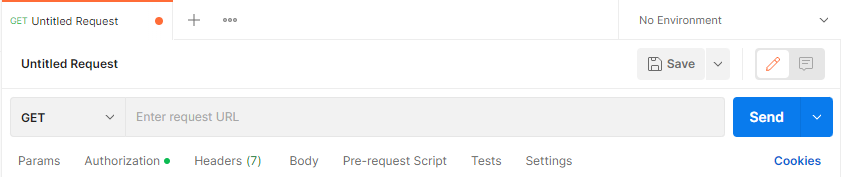
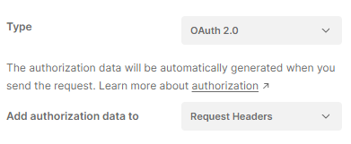
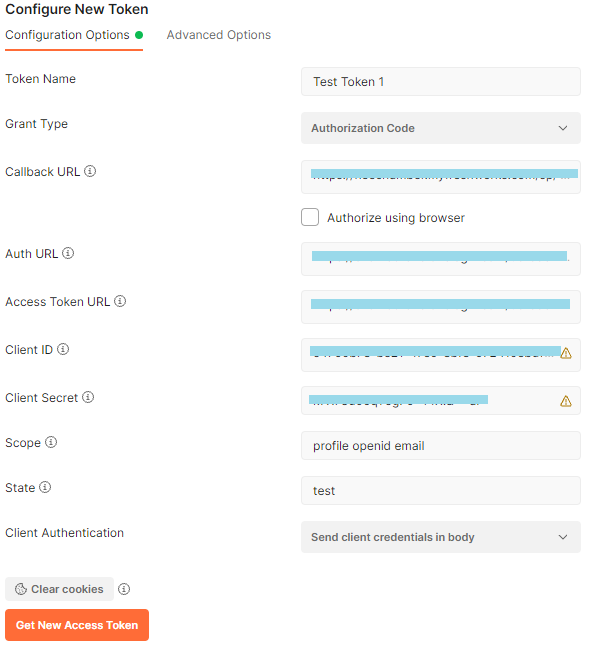
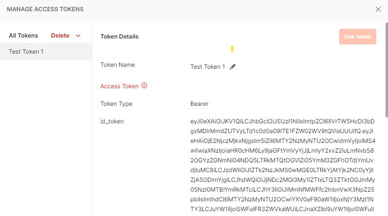

I had a problem where I needed to get my JWT token from Azure B2C OAuth 2.0 in order to troubleshoot an issue I was having in getting OAuth 2.0 working.

#### Situation

I needed to get the JWT token using Postman, decrypt it, and then provide it for troubleshooting the issue.

#### How did I do that

- Get postman
- Create a new request, as far as I am aware it makes no difference what type of request you use so in this example, I will use a **GET** request.

- Click on **Authorization**, and then choose Type **OAuth 2.0**, and then chose **Request Headers**

- Next, on the right-hand side of the screen you will see some options for **Configuring a New Token**
    - Enter in a **Token Name**, this is just used as a friendly name in postman as far as I am aware.
    - Choose a **Grant Type**, in this example I am using **Authorisation Code**.
    - Untick **Authorise using browser**, and enter in a **Callback URL**, this must be also configured within your client settings with your provider, in my case within App Registrations within Azure B2C.
    - Enter an **Auth URL**, in my case this is the authorisation endpoint in Azure B2C.
    - Enter an **Access Token URL**, in my case this is the token URL from Azure B2C
    - Enter in the **Client ID**, for Azure B2C I got this from app registrations
    - Enter in the **Client Secret**, for Azure B2C I got this from app registrations
    - For **Scope**, enter in the required scopes you want to test with, in my case this was **profile openid email**
    - Under **State** enter in anything you want, so for me this was just the word test.
    - Under **Client Authorisation**, choose **Send client credentials in body**. I am not sure what this setting does or means.

See my image below

- Once you have filled in everything, click on **Get New Access Token**, and it will then take you through the login process. Complete the login process and a pop up should appear with an access token.

- Copy the output for **id_token** to your clipboard, and then go to [https://jwt.io/](https://jwt.io/)
- Paste the encoded token in, and then the decoded token should appear.