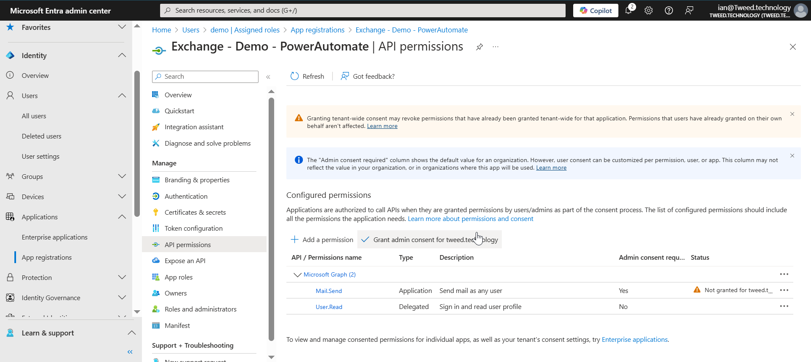
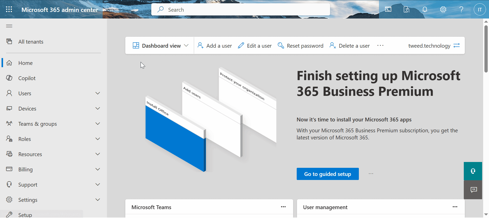

Want to send emails from a **Power Automate Flow** but **Can't** or **Don't want to** use a Service Account. Don't wan't to worry about Conditional Access Policy's, Password changes, and having to re-log in every few months. No need to worry about re-confirming policy's or Security information every 180 days.

Well today I am going to show you how you can send am email from Microsoft Exchange from a Power automate Flow using just a App Registration. I am going to share a Custom Connector with you I have created to enable you do to this. Then share with you how to Create the App Registration, permission the app registration, and how you can limit which email accounts the app registration can send from within exchange. 

## What you will need 

## Create the App Registration
For this section you will need the help of a Global Administrator

### Step 1 - Log in to Entra

By default most users will have the ability to go to [https://entra.microsoft.com](https://entra.microsoft.com)
and log in with your user account. 

### Step 2 - Create the app registration

Next we are going to create an application registration so our Power Automate flow can talk directly to Exchange Online.

1. When you are on the Entra Overview page, open up **Identity**.
2. Then navigate to **Applications** in the left hand menu and then open up **App Regestrations**. 
3. From there select **New Regestration**.
4. A new screen will open, give your new app registration a name and then click next.

### Step 3 - Add API permission

We then need to give our App Registration an API Permission, this wil be the permission it will use to talk to Exchange Online. 

1. In the left hand menu click on **API Permission**.
2. Click on **Add permission**.
3. A window will then open, select **Application Permission**.
4. Then using the search box type in **mail.send**.
5. The list will then filter, as it does open up the **Mail** option and select **mail.send**.

> **NOTE:** Yes this permission lets your send emails as anyone, however we will restrict this later. **DO NOT MISS USE IT IS POSSIBLE TO TRACK WHERE AN EMAIL CAME FROM**.

### Step 4 - Grant Admin consent

You will notice that the Grant admin consent is grayed out

This is becuse currently we have no administraton roles

Ask a Global administrator to grant admin consent for you

## Limiting application permissions in Exchange

Our next step is to limit what permissions our application will have within exchange, we have already said it will have `mail.send`
however without further limitation that ill allow the application to send emails from any users email account. 

> **Further reading:** Further information of these next steps can be found [here](https://learn.microsoft.com/en-us/graph/auth-limit-mailbox-access).

### Step 1 - Set up a Mail Enabled Security Group

- Set up a security group and add in who you will be able to send emails from
- 

##
- PowerShell Time
- Unfortunalty the next bit is not avaialbe witin the onine platform
b9701c1e-1364-464d-93e4-01ae925e8d6c
New-ApplicationAccessPolicy -AppId b9701c1e-1364-464d-93e4-01ae925e8d6c -PolicyScopeGroupId PowerAutomateTest@Tweed.technology -AccessRight RestrictAccess -Description "Restrict this app to members of PowerAutomateTest@Tweed.technology"

Lets break this down.....

Install-Module -Name ExchangeOnlineManagement -Force

##
Import-Module ExchangeOnlineManagement
Connect-ExchangeOnline -Device

ScopeName        : Power Automate Test
ScopeIdentity    : Power Automate Test20250209121934
Identity         : 63759d9f-bfca-4f52-ae98-8f2f1d7bc173\b9701c1e-1364-464d-93e4-01ae925e8d6c:S-1-5-21-3787302941-3231517822-469913106-31437838;9
                   98e9d79-817d-41c9-87d8-d9c07f27f4b2
AppId            : b9701c1e-1364-464d-93e4-01ae925e8d6c
ScopeIdentityRaw : S-1-5-21-3787302941-3231517822-469913106-31437838;998e9d79-817d-41c9-87d8-d9c07f27f4b2
Description      : Restrict this app to members of PowerAutomateTest@Tweed.technology
AccessRight      : RestrictAccess
ShardType        : All
IsValid          : True
ObjectState      : Unchanged

## test it in PowerShell
Test-ApplicationAccessPolicy -Identity testABC@Tweed.technology -AppId b9701c1e-1364-464d-93e4-01ae925e8d6c

PS /home/ian> Test-ApplicationAccessPolicy -Identity testABC@Tweed.technology -AppId b9701c1e-1364-464d-93e4-01ae925e8d6c

AppId             : b9701c1e-1364-464d-93e4-01ae925e8d6c
Mailbox           : testABC
MailboxId         : 75283b3b-609a-4c1c-b8b8-baa1342fdfa6
MailboxSid        : S-1-5-21-3787302941-3231517822-469913106-31499791
AccessCheckResult : Granted

PS /home/ian> Test-ApplicationAccessPolicy -Identity demo@Tweed.technology -AppId b9701c1e-1364-464d-93e4-01ae925e8d6c   

AppId             : b9701c1e-1364-464d-93e4-01ae925e8d6c
Mailbox           : demo
MailboxId         : d2ca4050-f8a9-4986-b998-387603b466b6
MailboxSid        : S-1-5-21-3787302941-3231517822-469913106-19344836
AccessCheckResult : Denied

PS /home/ian> Test-ApplicationAccessPolicy -Identity ian@Tweed.technology -AppId b9701c1e-1364-464d-93e4-01ae925e8d6c 

AppId             : b9701c1e-1364-464d-93e4-01ae925e8d6c
Mailbox           : ian.tweedie
MailboxId         : 0b5613ad-71fe-4b4c-9da3-b830f6df0607
MailboxSid        : S-1-5-21-3787302941-3231517822-469913106-5455427
AccessCheckResult : Denied

## Steps - Download and testing the connector