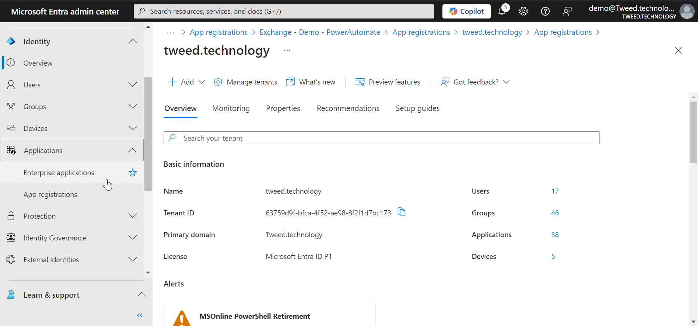
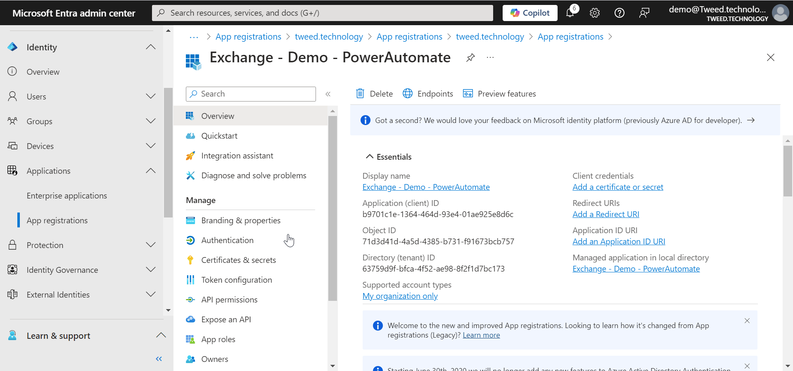
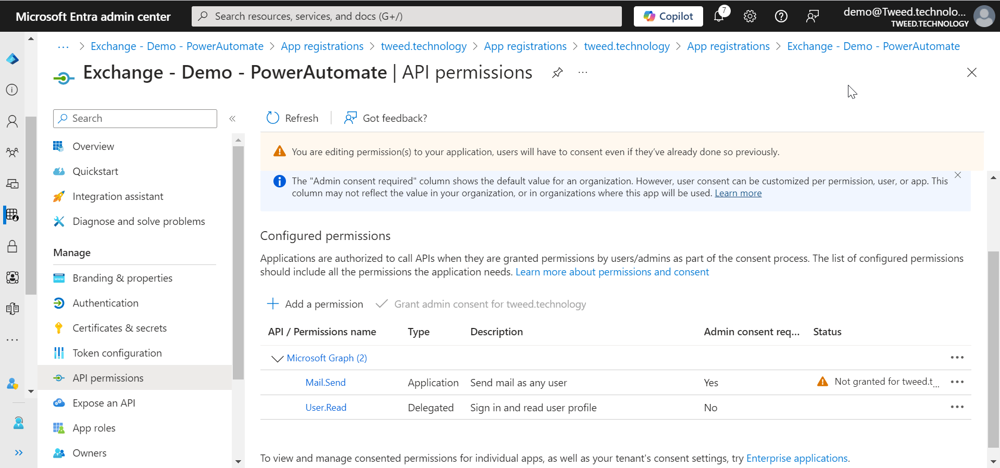

Want to send emails from a **Power Automate Flow** but **Can't** or **Don't want to** use a Service Account. Don't wan't to worry about Conditional Access Policy's, Password changes, and having to re-log in every few months. No need to worry about re-confirming policy's or Security information every 180 days.

Well today I am going to show you how you can send am email from Microsoft Exchange from a Power automate Flow using just a App Registration. I am going to share a Custom Connector with you I have created to enable you do to this. Then share with you how to Create the App Registration, permission the app registration, and how you can limit which email accounts the app registration can send from within exchange. 


## What you will need 


## Create the App Registration
For this section you will need the help of a Global Administrator

### Step 1 - Log in to Entra

By default most users will have the ability to go to [https://entra.microsoft.com](https://entra.microsoft.com)
and log in with your user account. 


### Step 2 - Create the app registration

Next we are going to create an application registration so our Power Automate flow can talk directly to Exchange Online.

1. When you are on the Entra Overview page, open up **Identity**.
2. Then navigate to **Applications** in the left hand menu and then open up **App Regestrations**. 
3. From there select **New Regestration**.
4. A new screen will open, give your new app registration a name and then click next.




### Step 3 - Add API permission

We then need to give our App Registration an API Permission, this wil be the permission it will use to talk to Exchange Online. 

1. In the left hand menu click on **API Permission**.
2. Click on **Add permission**.
3. A window will then open, select **Application Permission**.
4. Then using the search box type in **mail.send**.
5. The list will then filter, as it does open up the **Mail** option and select **mail.send**.

> **NOTE:** Yes this permission lets your send emails as anyone, however we will restrict this later. **DO NOT MISS USE IT IS POSSIBLE TO TRACK WHERE AN EMAIL CAME FROM**.




### Step 4 - Grant Admin consent

You will notice that the Grant admin consent is grayed out

This is becuse currently we have no administraton roles

Ask a Global administrator to grant admin consent for you


## Limiting application permissions in Exchange

Our next step is to limit what permissions our application will have within exchange, we have already said it will have `mail.send`
however without further limitation that ill allow the application to send emails from any users email account. 

> **Further reading:** Further information of these next steps can be found [here](https://learn.microsoft.com/en-us/graph/auth-limit-mailbox-access).


### Step 1 - Set up a Mail Enabled Security Group

When we tell exchange that we want to restrict access in some way for an application registration, we need to first create a **Mail-enabled Security group**.

There are a few ways to do this, however today we are going to do it from the Microsoft 365 Admin center.

1. Go to [Microsoft 365 Admin center](https://admin.microsoft.com/)
2. Then open up **Teams and Groups**.
3. Choose Security from the menu.
4. Click on **Add new security group**.


### Step 2 - Access PowerShell

For this next step we are going to use some **Powershell**. You can do this from a location of your choice however today we are going to demo it from **Cloud Shell**.

1. Navigate to Exchange Online [https://admin.cloud.microsoft/exchange#/homepage](https://admin.cloud.microsoft/exchange#/homepage).
2. Click on the **Cloud Shell** button in the top right hand corner. 


### Step 3 - Create Application Access Policy

Next we are going to create an application access policy using both the **Application ID** and the **Mail-enabled security group** we created in earlier steps. 

1. Lets look at our command. `New-ApplicationAccessPolicy -AppId b9701c1e-1364-464d-93e4-01ae925e8d6c -PolicyScopeGroupId PowerAutomateTest@Tweed.technology -AccessRight RestrictAccess -Description "Restrict this app to members of PowerAutomateTest@Tweed.technology"`
2. Breaking this down we have
   1. Command: `New-ApplicationAccessPolicy` - This cmdlet creates a new application access policy in Microsoft 365.
   2. Parameter: `-AppId b9701c1e-1364-464d-93e4-01ae925e8d6c` - Specifies the unique identifier (AppId) of the application for which the policy is being created.
   3. Parameter: `-PolicyScopeGroupId PowerAutomateTest@Tweed.technology` - Defines the scope of the policy by specifying the group ID (email address) that the policy will apply to.
   4. Parameter: `-AccessRight RestrictAccess` - Sets the access right for the policy. In this case, it restricts access.
   5. Parameter: `-Description "Restrict this app to members of PowerAutomateTest@Tweed.technology"` - Provides a description for the policy, explaining its purpose.
3. Lets try running the command in **PowerShell** using the **CloudShell**. 
4. Oh no, it doesn't work. You could be forgiven for thinking that given we have opened this up from the Exchange Admin center that we would indeed already have access to and be connected to exchange online within the **CloudShell** but unfortunately we are not. 
5. Therefore before we go any further we need to install the Exchange Online Management Module. `Install-Module -Name ExchangeOnlineManagement -Force`.


### Step 4 - Import and Connect

Our next step, is really to go back a stage and import and connect to Exchange Online. 

To do this we need to:

1. First we need to import the module we have just installed, to do this we run this command `Import-Module ExchangeOnlineManagement`
2. Next we need to connect to exchange, within the **CloudShell** the easiest way to to this is by using device login. Run this command `Connect-ExchangeOnline -Device`. 
3. This will give us a URL and a device code in order to log in to Exchange Online.
4. Next lets try re-running our command to create the new policy `New-ApplicationAccessPolicy -AppId b9701c1e-1364-464d-93e4-01ae925e8d6c -PolicyScopeGroupId PowerAutomateTest@Tweed.technology -AccessRight RestrictAccess -Description "Restrict this app to members of PowerAutomateTest@Tweed.technology"`
5. This time we get the response

```PowerShell
ScopeName        : Power Automate Test
ScopeIdentity    : Power Automate Test20250209121934
Identity         : 63759d9f-bfca-4f52-ae98-8f2f1d7bc173\b9701c1e-1364-464d-93e4-01ae925e8d6c:S-1-5-21-3787302941-3231517822-469913106-31437838;9
                   98e9d79-817d-41c9-87d8-d9c07f27f4b2
AppId            : b9701c1e-1364-464d-93e4-01ae925e8d6c
ScopeIdentityRaw : S-1-5-21-3787302941-3231517822-469913106-31437838;998e9d79-817d-41c9-87d8-d9c07f27f4b2
Description      : Restrict this app to members of PowerAutomateTest@Tweed.technology
AccessRight      : RestrictAccess
ShardType        : All
IsValid          : True
ObjectState      : Unchanged
```

 


### Step 5 - Let's test it in PowerShell
We can now test using PowerShell, to see if it's applied correctly. 

To do this:

1. We are going to run the following command `Test-ApplicationAccessPolicy -Identity testABC@Tweed.technology -AppId b9701c1e-1364-464d-93e4-01ae925e8d6c`
2. If we break down this command:
   1. Command: `Test-ApplicationAccessPolicy` - This cmdlet tests an application access policy in Microsoft 365 to verify if a user has access.
   2. Parameter: `-Identity testABC@Tweed.technology` - Specifies the identity (email address) of the user to test against the application access policy.
   3. Parameter: `-AppId b9701c1e-1364-464d-93e4-01ae925e8d6c` - Specifies the unique identifier (AppId) of the application for which the policy is being tested.
3. Running the command we get the following response:
      ```PowerShell
      AppId             : b9701c1e-1364-464d-93e4-01ae925e8d6c
      Mailbox           : testABC
      MailboxId         : 75283b3b-609a-4c1c-b8b8-baa1342fdfa6
      MailboxSid        : S-1-5-21-3787302941-3231517822-469913106-31499791
      AccessCheckResult : Granted
      ```
4. Let's test this against a different email address that is not within the **Mail-enabled security group** by running `Test-ApplicationAccessPolicy -Identity demo@Tweed.technology -AppId b9701c1e-1364-464d-93e4-01ae925e8d6c`.
      ```PowerShell  
      AppId             : b9701c1e-1364-464d-93e4-01ae925e8d6c
      Mailbox           : demo
      MailboxId         : d2ca4050-f8a9-4986-b998-387603b466b6
      MailboxSid        : S-1-5-21-3787302941-3231517822-469913106-19344836
      AccessCheckResult : Denied
      ```
5. We can see it has being **Denied** which is the response we expected. 


## Download and testing the connector