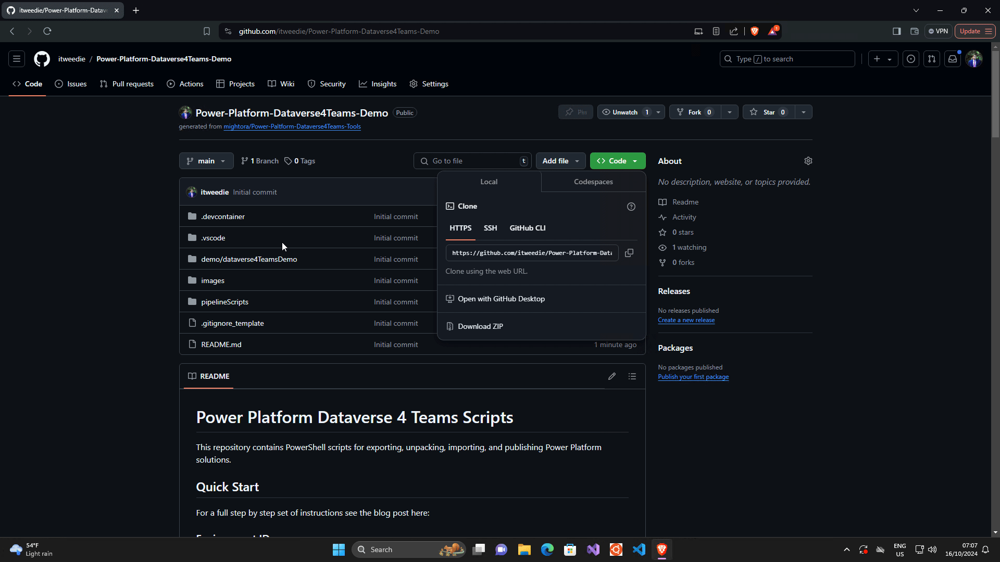
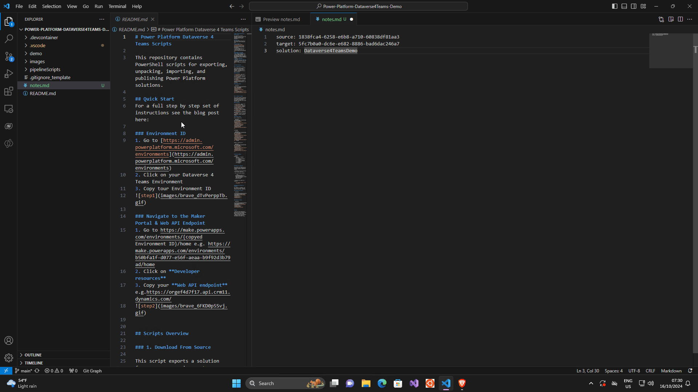
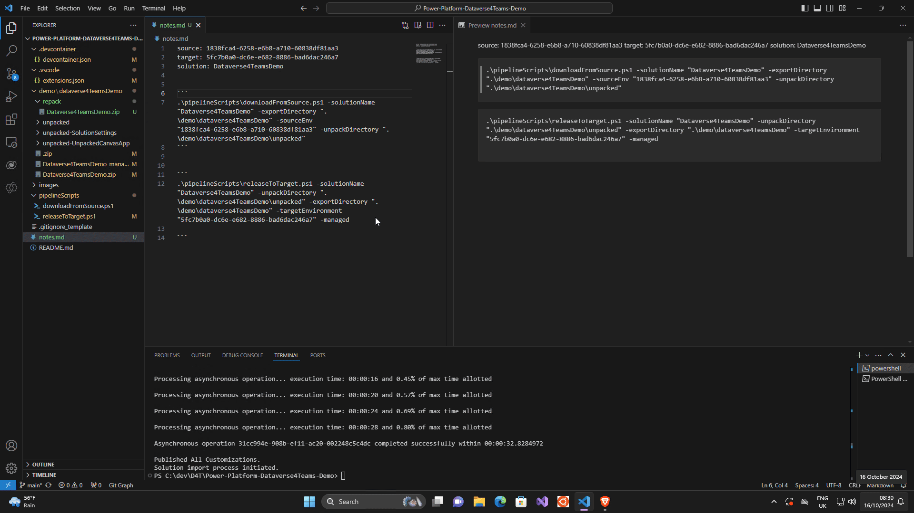
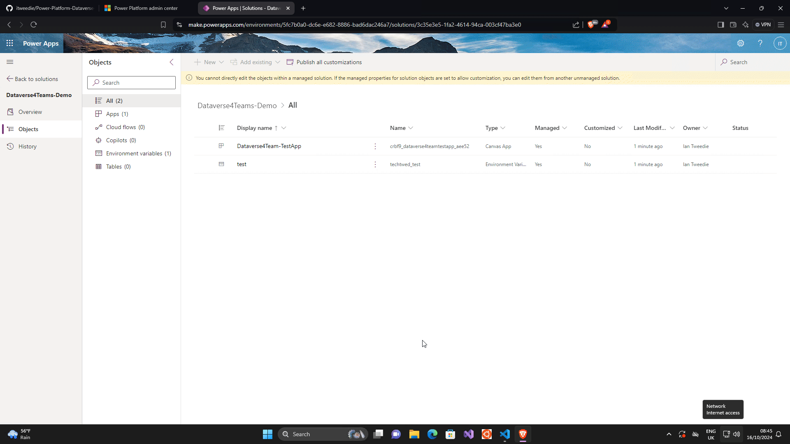

Do you need to move a Solution in **Dataverse for Teams** form one environment to another, are you unable to use a Pipeline to move a solution around? Want easy reputable steps? Need to be able to drill in to what changes have taken place between solution builds. 

Today I'm going to show you a tool that I have made to make this process easier by using a PowerShell Script to move Dataverse for Teams solutions between environments. 

# What you don't need
1. Azure DevOps - however if you have Azure DevOps I have a pipeline tool currently in **Preview** for you on the **Visual Studio Market Place**, you can find it [here!](https://marketplace.visualstudio.com/items?itemName=mightoraio.mightora-power-platform-devOps-extension)

# What you need
Things you need to follow along with this demo, however as you will see you don't need them all to use the tool. 

1. [Git](https://git-scm.com/downloads) - This is a small programme to help with source control.
2. [GitHub Account](https://github.com/) - If you won't to follow the steps exactly however you can also just download a copy of the repository. 
3. [Visual Studio Code]([Visual Studio Code - Code Editing. Redefined](https://code.visualstudio.com/)) - A free tool, or you can use another IDE of your preference. 
5. PowerShell and the ability to run `Set-ExecutionPolicy -ExecutionPolicy Unrestricted -Scope CurrentUser`

Any other tools are covered in the tutorial. 

# Steps to use the tool
## Step 1 - Copy the script

In this example we are going to use this repo: [Power-Paltform-Dataverse4Teams-Tools](https://github.com/mightora/Power-Paltform-Dataverse4Teams-Tools) 
as a template so we can get up and running quickly. 

When we use this template we are prompted for the location and name for your version of the repository, I have made mine public [here]([itweedie/Power-Platform-Dataverse4Teams-Demo (github.com)](https://github.com/itweedie/Power-Platform-Dataverse4Teams-Demo)), but you may wish to use private. 


Once created your version of the repository from the template, copy a link to it using the button just above the file list. 


However you could also import to an existing solution as a submodule using this command. 
```powershell
git submodule add https://github.com/mightora/Power-Platform-Dataverse4Teams-Tools.git scripts/dataverse4Teams
```
After doing this you will need to initialize and update the submodule running this command:
```powershell
git submodule update --init --recursive
```

> Please also note that you will have to update your script paths in the examples we give below.

## Step 2 - Clone the repository in to Visual Studio Code
For our example we are going to clone the repository in to Visual Studio Code, using the link from Step 1. 

To do this at the top of your **Visual Studio Code** window enter `> Clone` and **Git: Clone** should appear. 



## Step 3 - Get setup 
You will then be prompted to install the extensions that are useful when using this repository.   

> **If you are not** then navigate to **File** >  **Preferences** > **Settings** and search for `Extension Ignore Recommendations`  or use this [link](vscode://settings/extensions.ignoreRecommendations) and make sure it is not ticked. 


## Step 4 - Get Environment ID for source

We are going to need our **Environment ID** to use this script, to get this, navigate to [Environments | Power Platform admin center (microsoft.com)](https://admin.powerplatform.microsoft.com/environments) and locate your source environment. 

Go in to it and copy the **Environment ID**


## Step 5 - Get Environment ID for source

We now need to do the same for our **target Environment**.


## Step 6 - Check the source in the maker portal

You can do this by `https://make.powerapps.com/environments/{ENVIRONMENT ID HERE}/home`


### Step 7 - check the target in the maker portal

You can do this by `https://make.powerapps.com/environments/{ENVIRONMENT ID HERE}/home`


### Step 8 - Overview of what we are going to do

A quick overview of what we are going to be doing.




### Step 9 - Lets run the script
We are going to run the command 
```powershell
.\pipelineScripts\downloadFromSource.ps1 -solutionName "Dataverse4TeamsDemo" -exportDirectory ".\demo\dataverse4TeamsDemo" -sourceEnv "1838fca4-6258-e6b8-a710-60838df81aa3" -unpackDirectory ".\demo\dataverse4TeamsDemo\unpacked"
```

Please remember to replace the variables with your own, for more information please consult [README](https://github.com/mightora/Power-Paltform-Dataverse4Teams-Tools/blob/main/README.md)


### Step 10 - Explore our unpacked solution

This is where using GIT becomes very useful as you can see from the commits what the changes were on the solution between runs.


### Step 11 - Explore our unpacked solution

Lets push out solution to the target environment


### Step 12 - Lets see if it worked

Lets explore using the maker portal to see if it has worked. 



### Step 13 - Lets push our code

Finally lets push our code to our repo so next time we run it we can see changes between runs. When you come to do this you may need to set your user in **GIT**.

You can set your user in **GIT** by running the below commands with your information. 

```powershell
  git config --global user.email "you@example.com"

  git config --global user.name "Your Name"
```


